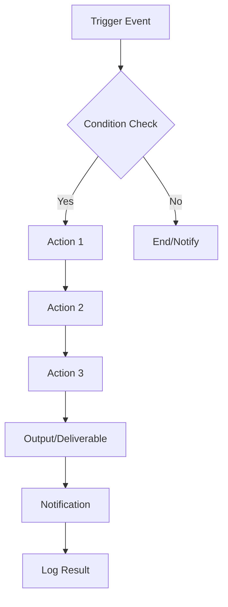

# Master SOP Template: Business Automation
**Fillable Template for Any Business Process Automation**

---

## 🎯 AUTOMATION OVERVIEW

**Automation Name:** [Your Automation Name]
**Purpose:** [What business problem does this solve? What's the ROI?]
**Impact:** [Time saved per week/month, error reduction, cost savings]
**Owner:** [Who owns this automation?]
**Last Updated:** [Date]

---

## 📊 BUSINESS IMPACT SUMMARY

### Before Automation
- **Time Required:** [X hours per week/month]
- **Error Rate:** [Current error rate or pain points]
- **Cost:** [Manual labor cost or opportunity cost]
- **Bottlenecks:** [List current bottlenecks]

### After Automation
- **Time Required:** [X minutes per week/month]
- **Error Rate:** [Target error rate]
- **Cost Savings:** [Annual savings estimate]
- **Efficiency Gain:** [X% faster]

### ROI Calculation
- **Setup Time:** [Hours to implement]
- **Ongoing Maintenance:** [Minutes per week]
- **Break-even Point:** [Weeks/Months]
- **Annual Time Savings:** [Hours]

---

## 🛠️ PREREQUISITES & TOOLS

### Required Tools
- [ ] [Tool 1] - [Purpose]
- [ ] [Tool 2] - [Purpose]
- [ ] [Tool 3] - [Purpose]

### Access Requirements
- [ ] [Permission 1]
- [ ] [Permission 2]
- [ ] [API access to...]

### Technical Skills Needed
- [ ] Technical: [Skill level required - beginner/intermediate/advanced]
- [ ] No-code/Low-code: [What platform knowledge needed]
- [ ] Training needed: [Yes/No - specify]

### Data Requirements
- **Input Data:** [What data does this automation need?]
- **Data Sources:** [Where does data come from?]
- **Data Format:** [Required format - CSV, JSON, API, etc.]
- **Data Frequency:** [Real-time, daily, weekly, etc.]

---

## 🔄 WORKFLOW DIAGRAM

### Workflow Steps
1. **Trigger:** [What starts the automation?]
2. **Condition:** [What must be true?]
3. **Actions:** [What happens step-by-step?]
4. **Output:** [What's the result?]
5. **Notification:** [Who gets notified?]
6. **Logging:** [How is it tracked?]

---

## 📋 STEP-BY-STEP INSTRUCTIONS

### Phase 1: Setup (One-Time)

#### Step 1.1: [Setup Step Title]
**Time Required:** [X minutes]
**Tools:** [Tools needed]

**Instructions:**
1. [Detailed instruction]
2. [Detailed instruction]
3. [Detailed instruction]

**Verification:**
- [ ] [How do you know this step is complete?]
- [ ] [What to check before proceeding]

---

#### Step 1.2: [Setup Step Title]
**Time Required:** [X minutes]
**Tools:** [Tools needed]

**Instructions:**
1. [Detailed instruction]
2. [Detailed instruction]

**Verification:**
- [ ] [Completion checklist]

---

### Phase 2: Configuration

#### Step 2.1: [Configuration Step Title]
**Time Required:** [X minutes]

**Instructions:**
1. [Detailed instruction]
2. [Detailed instruction]

**Settings to Configure:**
| Setting | Value | Notes |
|---------|-------|-------|
| [Setting 1] | [Value] | [Why this value] |
| [Setting 2] | [Value] | [Why this value] |

---

### Phase 3: Testing

#### Step 3.1: Initial Test Run
**Instructions:**
1. [How to trigger test run]
2. [What to observe]
3. [Expected result]

**Success Criteria:**
- [ ] [Success criteria 1]
- [ ] [Success criteria 2]

---

## 🧪 TESTING PROTOCOL

### Pre-Production Testing

#### Test Scenario 1: Normal Operation
**Test Data:** [What data to use]
**Expected Result:** [What should happen]
**Actual Result:** [What happened]
**Status:** Pass/Fail

#### Test Scenario 2: Edge Case [e.g., Empty Data]
**Test Data:** [Edge case data]
**Expected Result:** [How should it handle?]
**Actual Result:** [What happened]
**Status:** Pass/Fail

#### Test Scenario 3: Error Handling
**Test Data:** [Error condition]
**Expected Result:** [Graceful error message/fallback]
**Actual Result:** [What happened]
**Status:** Pass/Fail

---

### User Acceptance Testing (UAT)

**Testers:** [Who will test?]
**Testing Period:** [How long?]
**Sign-off Required:** [Who approves?]

**UAT Checklist:**
- [ ] [Works as expected]
- [ ] [Error handling works]
- [ ] [Documentation is clear]
- [ ] [Team trained]
- [ ] [Backup plan documented]

---

## 📈 MONITORING & MAINTENANCE

### Daily Monitoring
**Time Required:** [X minutes]
**Checks:**
- [ ] [Check automation ran successfully]
- [ ] [Check for errors]
- [ ] [Verify outputs]

### Weekly Maintenance
**Time Required:** [X minutes]
**Tasks:**
- [ ] [Review error logs]
- [ ] [Check data quality]
- [ ] [Update any templates]

### Monthly Reviews
**Time Required:** [X minutes]
**Tasks:**
- [ ] [ROI analysis]
- [ ] [Performance review]
- [ ] [Optimization opportunities]

---

## 🚨 TROUBLESHOOTING GUIDE

### Common Issues & Solutions

#### Issue #1: [Common Problem]
**Symptoms:**
- [What you see]
- [Error messages]

**Root Cause:**
[Why it happens]

**Solution:**
1. [Step 1]
2. [Step 2]
3. [Step 3]

**Prevention:**
[How to avoid this issue]

---

#### Issue #2: [Common Problem]
**Symptoms:**
- [What you see]

**Root Cause:**
[Why it happens]

**Solution:**
1. [Step 1]
2. [Step 2]

---

## 🔙 ROLLBACK PROCEDURES

### When to Roll Back
- [Critical failure condition 1]
- [Critical failure condition 2]
- [Data integrity issue]

### Rollback Steps

#### Option 1: Manual Override
**Time Required:** [X minutes]
**Steps:**
1. [Disable automation]
2. [Switch to manual process]
3. [Notify stakeholders]

#### Option 2: Previous Version
**Time Required:** [X minutes]
**Steps:**
1. [Revert to previous configuration]
2. [Verify data integrity]
3. [Test before resuming]

### Recovery Checklist
- [ ] [Automation disabled]
- [ ] [Stakeholders notified]
- [ ] [Manual process in place]
- [ ] [Root cause identified]
- [ ] [Fix implemented]
- [ ] [Tested before re-enabling]

---

## 👥 TEAM HANDOFF

### Training Requirements

#### For [Role 1]
**Training Time:** [X hours]
**Topics:**
- [ ] [Topic 1]
- [ ] [Topic 2]
- [ ] [Topic 3]

#### For [Role 2]
**Training Time:** [X hours]
**Topics:**
- [ ] [Topic 1]

---

### Quick Reference Card

**Trigger:** [How to start automation]
**Monitor:** [Where to check status]
**Fix Common Issues:** [Where to find help]
**Contact:** [Who to contact for support]

---

### Knowledge Base Links
- [Full Documentation]: [Link]
- [Video Tutorial]: [Link]
- [Troubleshooting Guide]: [Link]
- [Change Log]: [Link]

---

## 📝 CHANGE LOG

| Date | Change | Impact | Who |
|------|--------|--------|-----|
| [Date] | [What changed] | [Why it matters] | [Who made change] |

---

## ✅ IMPLEMENTATION CHECKLIST

### Pre-Launch
- [ ] [All testing complete]
- [ ] [Stakeholders notified]
- [ ] [Documentation complete]
- [ ] [Training complete]
- [ ] [Rollback plan ready]

### Launch Day
- [ ] [Enable automation]
- [ ] [Monitor first run]
- [ ] [Verify outputs]
- [ ] [Check notifications]
- [ ] [Document any issues]

### Post-Launch (Week 1)
- [ ] [Daily monitoring complete]
- [ ] [Review error logs]
- [ ] [Gather user feedback]
- [ ] [Make adjustments]

---

## 📊 SUCCESS METRICS

### Key Performance Indicators (KPIs)
| Metric | Before | After | Target | Current |
|--------|--------|-------|--------|---------|
| [Time per task] | [X] | [Y] | [Z] | [Current] |
| [Error rate] | [X%] | [Y%] | [Z%] | [Current] |
| [Cost] | [$X] | [$Y] | [$Z] | [Current] |

### Review Schedule
- **Weekly:** [What to review weekly]
- **Monthly:** [What to review monthly]
- **Quarterly:** [What to review quarterly]

---

## 🎯 NEXT STEPS

### Immediate (This Week)
- [ ] [Next action 1]
- [ ] [Next action 2]

### Short-term (This Month)
- [ ] [Improvement 1]
- [ ] [Improvement 2]

### Long-term (Next Quarter)
- [ ] [Expansion 1]
- [ ] [Expansion 2]

---

## 📞 SUPPORT CONTACTS

| Role | Name | Contact | When to Contact |
|------|------|---------|-----------------|
| [Automation Owner] | [Name] | [Email/Slack] | [When] |
| [Technical Support] | [Name] | [Email/Slack] | [When] |
| [Business Stakeholder] | [Name] | [Email/Slack] | [When] |

---

**Template Version:** 3.0
**Last Updated:** 2026-03-13
**Created By:** Business Automation Team

---

## 💡 AUTOMATION PRINCIPLES

### The 80/20 Rule
Automate the 20% of tasks that consume 80% of your time.

### Error Reduction
Manual processes have 3-5% error rates. Automated processes can achieve <0.1%.

### Start Simple
Begin with small automations, learn, then scale.

### Document Everything
If the only person who understands the automation leaves, you're back to manual work.

### Test Before Trusting
Never deploy an automation without thorough testing.

### Monitor Initially
Check daily for the first week, then weekly for the first month.

### Have a Backup
Always know how to do it manually if the automation fails.

---

**Remember:** Systems before willpower. Automate the boring, keep the human.
