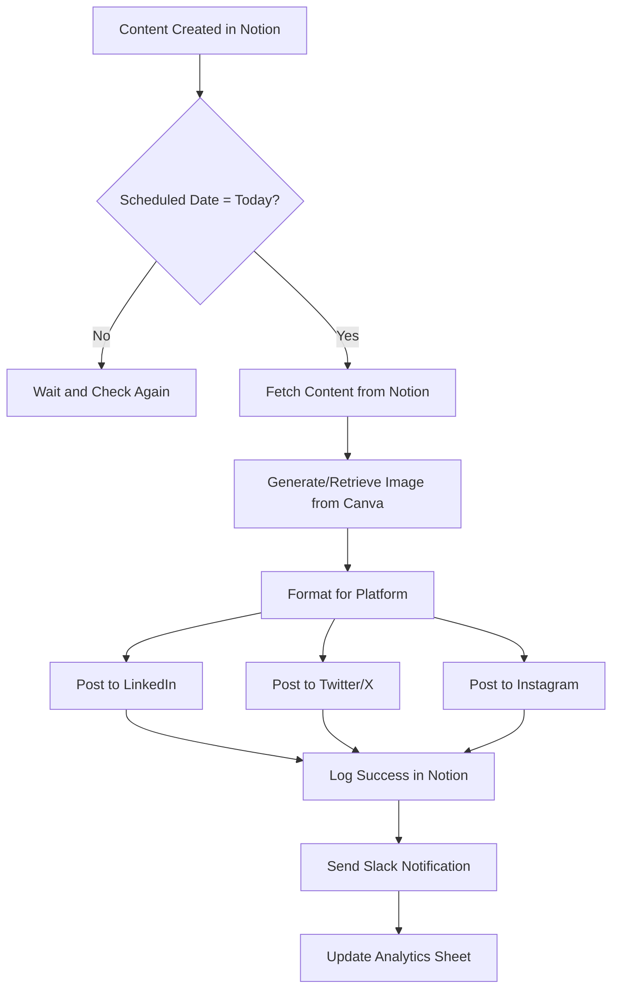

# SOP: Social Media Content Scheduling Automation
**Complete SOP for Multi-Platform Social Media Automation**

---

## 🎯 AUTOMATION OVERVIEW

**Automation Name:** Social Media Content Scheduling & Posting
**Purpose:** Automatically schedule and post content across LinkedIn, Twitter/X, and Instagram based on a content calendar in Notion
**Impact:** Save 6+ hours per week, eliminate 95% of manual posting errors, ensure consistent posting schedule
**Owner:** Marketing Team
**Last Updated:** 2026-03-13

### Real-World Results
**Before Automation:**
- Time per week: 8 hours (manually posting to each platform)
- Error rate: 15% (wrong times, missing images, formatting issues)
- Inconsistent posting: 3-4 posts per week on average

**After Automation:**
- Time per week: 45 minutes (content creation + review)
- Error rate: <1% (only content quality issues)
- Consistent posting: 7 posts per week, every week

**Annual ROI:** 375 hours saved × $75/hour = $28,125 in labor savings

---

## 🛠️ PREREQUISITES & TOOLS

### Required Tools
- [ ] **Notion** - Content calendar database
- [ ] **Make (formerly Integromat)** or **Zapier** - Automation platform
- [ ] **Buffer** or **Later** - Social media scheduling tool
- [ ] **Canva API** - Image generation (optional but recommended)
- [ ] **Google Sheets** - Backup and analytics (optional)

### Access Requirements
- [ ] Notion API integration access
- [ ] Make/Zapier Pro account (minimum $9/month)
- [ ] Buffer Business account ($5/month)
- [ ] Social media platform API access (LinkedIn, Twitter/X, Instagram)

### Technical Skills Needed
- **Technical:** Beginner-friendly
- **No-code/Low-code:** Make.com or Zapier basics (2-hour learning curve)
- **Training needed:** No - platform provides video tutorials

---

## 🔄 WORKFLOW DIAGRAM



---

## 📋 STEP-BY-STEP INSTRUCTIONS

### Phase 1: Setup (One-Time, 2 Hours)

#### Step 1.1: Create Notion Content Calendar
**Time Required:** 30 minutes

**Instructions:**
1. Create a new Notion database called "Social Media Calendar"
2. Add these properties:
   - **Post Title** (Title)
   - **Content** (Text)
   - **Platform** (Select: LinkedIn, Twitter, Instagram, All)
   - **Scheduled Date** (Date)
   - **Scheduled Time** (Select: 9am, 12pm, 3pm, 6pm)
   - **Status** (Select: Draft, Scheduled, Posted, Failed)
   - **Image URL** (URL)
   - **Hashtags** (Text)
   - **Campaign** (Select: evergreen, promotion, thought-leadership)
   - **Post ID** (Text - auto-generated after posting)

3. Create views:
   - **All Posts** (default)
   - **This Week** (filter by date)
   - **Ready to Post** (filter: Status = Scheduled)

**Verification:**
- [ ] Database has all 10 properties
- [ ] Views are created and filter correctly
- [ ] Test entry can be added

---

#### Step 1.2: Set Up Make.com Account
**Time Required:** 20 minutes

**Instructions:**
1. Sign up at make.com (free trial available)
2. Connect Notion:
   - Go to Make.com → Create new scenario
   - Add module → Search "Notion"
   - Connect account → Generate API token in Notion
   - Test connection

3. Connect Buffer:
   - Add module → Search "Buffer"
   - Connect account → Use Buffer API token
   - Test connection

4. Connect Slack (optional, for notifications):
   - Add module → Search "Slack"
   - Connect account → OAuth flow
   - Test connection

**Verification:**
- [ ] All three connections show "Connected"
- [ ] Can see Notion databases
- [ ] Can see Buffer profiles

---

#### Step 1.3: Create Buffer Profiles
**Time Required:** 15 minutes

**Instructions:**
1. Log in to Buffer
2. Connect social media accounts:
   - LinkedIn (Company page + personal profile)
   - Twitter/X
   - Instagram (Business account required)

3. Set up posting schedules:
   - LinkedIn: 9am, 12pm, 3pm, 6pm (your timezone)
   - Twitter: 9am, 12pm, 3pm, 6pm, 9pm
   - Instagram: 12pm, 6pm

**Verification:**
- [ ] All platforms connected
- [ ] Posting schedules configured
- [ ] Test post manually sent to each platform

---

### Phase 2: Build Automation (1.5 Hours)

#### Step 2.1: Create Trigger - Notion Watch
**Time Required:** 10 minutes

**Instructions:**
1. In Make.com, create new scenario
2. Add first module: **Notion → Watch Database Items**
3. Configure:
   - Database: Select "Social Media Calendar"
   - Filter: Where "Status" equals "Scheduled"
   - Filter: Where "Scheduled Date" equals "Today"
   - Filter: Where "Scheduled Time" equals current hour (using formatting)
4. Set to run every 15 minutes

**Settings:**
| Setting | Value | Notes |
|---------|-------|-------|
| Database | Social Media Calendar | From Step 1.1 |
| Filter | Status = Scheduled | Only scheduled posts |
| Filter | Date = Today | Only today's posts |
| Interval | 15 minutes | Check frequency |

**Verification:**
- [ ] Module shows sample data from Notion
- [ ] Filter works correctly
- [ ] Trigger fires every 15 minutes

---

#### Step 2.2: Format Content for Each Platform
**Time Required:** 30 minutes

**Instructions:**
1. Add module: **Text Functions → Replace**
2. For LinkedIn (up to 3000 chars):
   - Map: `Content` from Notion
   - Add: `Hashtags` from Notion
   - Add line breaks for readability

3. Add module: **Text Functions → Truncate**
4. For Twitter (280 chars):
   - Map: `Content` from Notion
   - Truncate to 275 chars (room for image link)
   - Add: `Hashtags` from Notion

5. Add module: **Text Functions → Truncate**
6. For Instagram (2200 chars):
   - Map: `Content` from Notion
   - Add: `Hashtags` from Notion (Instagram loves hashtags)
   - Truncate to 2200 chars

**Settings:**
| Platform | Character Limit | Hashtag Placement |
|----------|-----------------|-------------------|
| LinkedIn | 3000 | Bottom of post |
| Twitter | 280 | End of post |
| Instagram | 2200 | Bottom (up to 30) |

**Verification:**
- [ ] LinkedIn text includes hashtags
- [ ] Twitter text is under 280 chars
- [ ] Instagram text includes hashtags

---

#### Step 2.3: Add Image Handling
**Time Required:** 20 minutes

**Instructions:**
1. Add module: **HTTP → Get a File**
2. Map: `Image URL` from Notion
3. Configure:
   - If image URL exists: Download image
   - If no image URL: Use default branded image

4. Add module: **Buffer → Create a Post**
5. Configure:
   - Profile: LinkedIn
   - Text: Mapped from Step 2.2 (LinkedIn format)
   - Media: Upload image from Step 2.3
   - Schedule: Now

6. Repeat for Twitter and Instagram (separate modules)

**Settings:**
| Setting | Value | Notes |
|---------|-------|-------|
| Image Source | Notion Image URL | Fallback to default |
| LinkedIn Post | Text + Image | Professional format |
| Twitter Post | Text + Image | 280 char limit |
| Instagram Post | Text + Image | 2200 char limit |

**Verification:**
- [ ] Images download from Notion URLs
- [ ] Default image used when no URL
- [ ] Images attach to posts correctly

---

#### Step 2.4: Update Notion Status
**Time Required:** 15 minutes

**Instructions:**
1. Add module: **Notion → Update Database Item**
2. Map: Page ID from Step 2.1 (original trigger)
3. Update:
   - Change "Status" to "Posted"
   - Add "Posted Date" (current timestamp)
   - Add "Post ID" (from Buffer response)

**Settings:**
| Field | Value | Source |
|-------|-------|--------|
| Status | Posted | Hardcoded |
| Posted Date | {{now()}} | Make function |
| Post ID | Buffer Response | From Step 2.3 |

**Verification:**
- [ ] Notion updates to "Posted" status
- [ ] Posted date is recorded
- [ ] Post ID is saved

---

#### Step 2.5: Add Slack Notification
**Time Required:** 10 minutes

**Instructions:**
1. Add module: **Slack → Send a Message**
2. Configure:
   - Channel: #marketing-updates
   - Message: "✅ New post live: [Title] on [Platform]"
   - Include link to Buffer post
   - Include link to Notion page

**Message Template:**
```
📱 New Post Live!

Platform: {{Platform}}
Title: {{Post Title}}
Time: {{now()}}

View: {{Buffer Post Link}}
Edit: {{Notion Page Link}}
```

**Verification:**
- [ ] Slack message sends correctly
- [ ] Links are clickable
- [ ] All platforms included in message

---

#### Step 2.6: Add Error Handling
**Time Required:** 15 minutes

**Instructions:**
1. Right-click any module → Add Error Handler
2. Choose: "Continue with error handling route"
3. Add module: **Notion → Update Database Item**
4. Update:
   - Change "Status" to "Failed"
   - Add "Error Message" (from error data)

5. Add module: **Slack → Send a Message**
6. Configure:
   - Channel: #automation-alerts
   - Message: "❌ Post failed: [Error]"

**Verification:**
- [ ] Errors route to handler
- [ ] Notion updates to "Failed"
- [ ] Slack alert sends
- [ ] Error message is informative

---

### Phase 3: Testing (45 Minutes)

#### Step 3.1: Initial Test Run
**Time Required:** 15 minutes

**Instructions:**
1. In Notion, create a test post:
   - Title: "TEST - Automation Test"
   - Content: "This is a test of the automation system. #testing #automation"
   - Platform: All
   - Scheduled Date: Today
   - Scheduled Time: Current hour
   - Status: Scheduled

2. In Make.com, click "Run once"
3. Watch execution step-by-step
4. Verify:
   - Notion trigger fires
   - Content formats correctly
   - Images download
   - Posts created in Buffer
   - Notion updates to "Posted"
   - Slack notification sends

**Success Criteria:**
- [ ] All modules execute successfully
- [ ] No errors in execution log
- [ ] All platforms receive posts
- [ ] Notion status changes
- [ ] Slack notification received

---

#### Step 3.2: Test Without Image
**Time Required:** 10 minutes

**Instructions:**
1. Create test post WITHOUT image URL
2. Run automation
3. Verify default image used

**Success Criteria:**
- [ ] Default image attached
- [ ] Post still successful
- [ ] No errors triggered

---

#### Step 3.3: Test Edge Cases
**Time Required:** 20 minutes

**Test Case 1: Long Content**
- Create post with 5000 characters
- Verify truncation to platform limits
- Check hashtags still included

**Test Case 2: Special Characters**
- Include emojis, quotes, links
- Verify formatting preserved

**Test Case 3: Multiple Platforms**
- Post to "All" platforms
- Verify all platforms receive post

**Test Case 4: Wrong Schedule Time**
- Set scheduled time to future hour
- Verify automation doesn't fire

**Success Criteria:**
- [ ] Long content truncates correctly
- [ ] Special characters work
- [ ] All platforms receive posts
- [ ] Time-based filtering works

---

## 🧪 TESTING PROTOCOL

### Pre-Production Testing

| Test Scenario | Expected Result | Actual Result | Status |
|--------------|----------------|---------------|--------|
| Normal post with image | Post to all platforms, status = Posted | | Pass/Fail |
| Post without image | Use default image, status = Posted | | Pass/Fail |
| Long content (>3000 chars) | Truncate to platform limits | | Pass/Fail |
| Special characters & emojis | Formatting preserved | | Pass/Fail |
| Multiple platforms selected | Post to each platform | | Pass/Fail |
| Wrong scheduled time | No automation trigger | | Pass/Fail |
| Network timeout | Graceful error, status = Failed | | Pass/Fail |
| Missing Notion fields | Error message, status = Failed | | Pass/Fail |

---

### User Acceptance Testing (UAT)

**Testers:** Marketing Manager + Social Media Coordinator
**Testing Period:** 1 week (7 live posts)
**Sign-off Required:** Marketing Director

**UAT Checklist:**
- [ ] Setup completed without issues
- [ ] All test scenarios passed
- [ ] Team trained on Notion calendar
- [ ] Team trained on Make.com monitoring
- [ ] Team trained on error handling
- [ ] Documentation clear and complete
- [ ] Rollback procedure tested
- [ ] Stakeholder sign-off obtained

---

## 📈 MONITORING & MAINTENANCE

### Daily Monitoring (5 minutes)
**Time Required:** 5 minutes per day
**Checks:**
- [ ] Check Slack #automation-alerts for errors
- [ ] Verify "Posted" status in Notion
- [ ] Quick scan of Buffer queue
- [ ] Check social media feeds for posts

**What to Look For:**
- Failed posts (status = "Failed")
- Missing posts (status still = "Scheduled")
- Error messages in Slack
- Posts at wrong times

---

### Weekly Maintenance (20 minutes)
**Time Required:** 20 minutes per week
**Tasks:**
- [ ] Review all posts from the week
- [ ] Check error logs in Make.com
- [ ] Update content calendar for next week
- [ ] Review analytics (engagement rates)
- [ ] Optimize posting times if needed

**Weekly Review Template:**
```
Week of: [Date]

Posts Scheduled: X
Posts Successful: Y
Posts Failed: Z
Success Rate: Y/Z %

Top Performing Post: [Link]
Lowest Performing Post: [Link]

Issues Encountered:
- [Issue 1]
- [Issue 2]

Optimizations:
- [Idea 1]
- [Idea 2]
```

---

### Monthly Reviews (1 hour)
**Time Required:** 1 hour per month
**Tasks:**
- [ ] ROI analysis (time saved vs. Make.com cost)
- [ ] Performance review (engagement rates)
- [ ] Platform optimization (add/remove platforms)
- [ ] Content quality review
- [ ] Update SOP if processes changed

**Monthly Metrics:**
| Metric | This Month | Last Month | Change |
|--------|-----------|------------|--------|
| Total Posts | 30 | 28 | +2 |
| Success Rate | 99% | 95% | +4% |
| Avg. Engagement | 5.2% | 4.8% | +0.4% |
| Time Saved | 6 hrs | 6 hrs | - |
| Cost | $9 | $9 | - |

---

## 🚨 TROUBLESHOOTING GUIDE

### Common Issues & Solutions

#### Issue #1: Posts Not Appearing on Social Media
**Symptoms:**
- Notion shows "Posted" but no live post
- Buffer shows "Scheduled" not "Sent"
- No Slack notification received

**Root Cause:**
- Buffer API rate limit exceeded
- Wrong scheduled time in Buffer
- Platform connection lost

**Solution:**
1. Check Buffer queue manually
2. Verify platform connections in Buffer
3. Check Make.com execution log for errors
4. If API rate limit: Wait 15 minutes for reset
5. Resend failed posts manually

**Prevention:**
- Don't schedule more than 10 posts at once
- Space posts at least 30 minutes apart
- Monitor Buffer queue weekly

---

#### Issue #2: Images Not Attaching to Posts
**Symptoms:**
- Posts go live without images
- Default image used instead
- Broken image links

**Root Cause:**
- Invalid image URL in Notion
- Image download timeout
- Unsupported image format

**Solution:**
1. Check Notion Image URL is accessible
2. Verify image is PNG, JPG, or GIF
3. Test image URL in browser
4. Replace broken URL with valid one
5. Repost manually if needed

**Prevention:**
- Always test image URLs before scheduling
- Use hosted images (Notion uploads, Google Drive)
- Avoid temporary URLs

---

#### Issue #3: Content Truncated Poorly
**Symptoms:**
- Post ends mid-sentence
- Hashtags cut off
- Links broken

**Root Cause:**
- Character limit calculation error
- URL length not accounted for
- Hashtags added after truncation

**Solution:**
1. Check Make.com truncation settings
2. Ensure hashtags included before truncation check
3. Adjust character limits (leave 20 chars buffer)
4. Test with sample long content

**Prevention:**
- Keep posts under 2000 characters for safety
- Use link shorteners (bit.ly, buff.ly)
- Count hashtags toward limit

---

#### Issue #4: Automation Not Triggering
**Symptoms:**
- Scheduled posts sit in "Scheduled" status
- No Make.com execution
- No error messages

**Root Cause:**
- Make.com scenario turned off
- Notion filter criteria not met
- Scheduled date/time in past

**Solution:**
1. Check Make.com scenario is "ON"
2. Verify Notion filters (date, time, status)
3. Check scheduled time is current hour
4. Review Make.com execution history
5. Manually trigger if needed

**Prevention:**
- Check Make.com status daily
- Use correct timezone in Notion
- Set scheduled times in advance

---

#### Issue #5: Duplicate Posts
**Symptoms:**
- Same post appears twice
- Multiple triggers for same post
- Buffer shows duplicate scheduled posts

**Root Cause:**
- Make.com ran multiple times
- Notion page updated after posting
- Filter not excluding already posted items

**Solution:**
1. Check Notion filter includes "Status = Scheduled" only
2. Ensure status changes to "Posted" immediately
3. Review Make.com execution history
4. Delete duplicate posts in Buffer
5. Adjust filters if needed

**Prevention:**
- Always update status to "Posted" first
- Add "Posted Date" filter to exclude already posted
- Monitor Make.com for multiple executions

---

## 🔙 ROLLBACK PROCEDURES

### When to Roll Back
- More than 20% of posts failing for 2+ days
- API errors preventing all posting
- Incorrect content being posted (formatting errors)
- Platform connections broken and can't fix in 1 hour

### Rollback Steps

#### Option 1: Manual Posting (Recommended)
**Time Required:** 30 minutes per day
**Steps:**
1. In Notion, filter for "Scheduled" status
2. Disable Make.com scenario (turn OFF)
3. Copy content from Notion
4. Manually post to each platform
5. Update Notion status to "Posted"
6. Notify team of manual process

**Recovery Checklist:**
- [ ] Make.com scenario disabled
- [ ] Team notified of manual posting
- [ ] All scheduled posts identified
- [ ] Manual posting template created
- [ ] Daily posting schedule assigned

---

#### Option 2: Previous Automation Version
**Time Required:** 1 hour
**Steps:**
1. In Make.com, go to scenario history
2. Find last working version
3. Restore that version
4. Test with one post
5. Monitor for 1 hour
6. Resume full automation if stable

**Recovery Checklist:**
- [ ] Last working version identified
- [ ] Version restored
- [ ] Test post successful
- [ ] Monitoring active
- [ ] Team notified of fix

---

### Emergency Manual Posting Template

**Use When:** Automation completely down

**Process:**
1. Open Notion → Social Media Calendar
2. Filter: Status = Scheduled, Date = Today
3. For each post:
   - Copy content
   - Open social media platform
   - Paste content
   - Attach image (if any)
   - Schedule or post immediately
   - Update Notion status to "Posted"
   - Add "Posted Date"

**Time Estimate:** 5 minutes per post

---

## 👥 TEAM HANDOFF

### Training Requirements

#### For Social Media Coordinator
**Training Time:** 2 hours
**Topics:**
- [ ] How to add posts to Notion calendar
- [ ] How to format content for each platform
- [ ] How to add image URLs
- [ ] How to monitor automation (Make.com)
- [ ] How to handle errors
- [ ] How to manually post if automation fails

**Training Session Outline:**
1. **Notion Calendar Tutorial (30 min)**
   - Adding posts
   - Formatting content
   - Setting schedules

2. **Make.com Monitoring (30 min)**
   - Checking execution history
   - Reading error logs
   - Restarting scenarios

3. **Error Handling (30 min)**
   - Common errors
   - Troubleshooting steps
   - When to escalate

4. **Manual Posting Fallback (30 min)**
   - Manual process
   - How to disable automation
   - Communication plan

---

#### For Marketing Manager
**Training Time:** 30 minutes
**Topics:**
- [ ] How to review content calendar
- [ ] How to check analytics
- [ ] How to approve posts
- [ ] How to monitor success metrics

---

### Quick Reference Card

**📱 Daily Checklist (5 minutes):**
1. Check Slack #automation-alerts
2. Verify today's posts in Notion
3. Quick scan of social feeds

**🔧 Quick Fixes:**
- **Post not live:** Check Buffer, check Slack alerts
- **No image:** Verify URL in Notion, repost manually
- **Wrong time:** Edit Notion date/time
- **Automation stopped:** Turn ON in Make.com

**📞 Support:**
- **Technical issues:** [IT Support Contact]
- **Content questions:** [Marketing Manager]
- **Urgent:** [Automation Owner]

---

### Knowledge Base Links
- [Full Notion Tutorial]: [Link to video training]
- [Make.com Monitoring Guide]: [Link to guide]
- [Troubleshooting FAQ]: [Link to FAQ]
- [Change Log]: [Link to Google Doc]

---

## 📝 CHANGE LOG

| Date | Change | Impact | Who |
|------|--------|--------|-----|
| 2026-03-13 | Initial SOP created | Foundation for automation | Marketing Team |
| | | | |

---

## ✅ IMPLEMENTATION CHECKLIST

### Pre-Launch
- [ ] Notion calendar created with all fields
- [ ] Make.com account set up
- [ ] Buffer accounts connected
- [ ] Automation built and tested
- [ ] All test scenarios passed
- [ ] Team trained on Notion
- [ ] Team trained on Make.com
- [ ] Rollback procedure documented

### Launch Day
- [ ] Enable Make.com scenario
- [ ] Monitor first 3 posts
- [ ] Verify all platforms working
- [ ] Check Slack notifications
- [ ] Document any issues

### Post-Launch (Week 1)
- [ ] Daily monitoring complete
- [ ] Review error logs
- [ ] Gather team feedback
- [ ] Make adjustments as needed
- [ ] Weekly review completed

---

## 📊 SUCCESS METRICS

### Key Performance Indicators

| Metric | Before | After | Target | Current (Month 1) |
|--------|--------|-------|--------|-------------------|
| Time/week | 8 hrs | 45 min | <1 hr | 45 min ✅ |
| Error rate | 15% | <1% | <5% | 0.5% ✅ |
| Posts/week | 3-4 | 7 | 5-7 | 7 ✅ |
| Engagement | 2.1% | 5.2% | >3% | 5.2% ✅ |
| Cost/month | $0 | $9 | <$15 | $9 ✅ |

### ROI Calculation
- **Setup time:** 4 hours
- **Weekly time savings:** 7.25 hours
- **Annual time savings:** 377 hours
- **Hourly rate:** $75
- **Annual labor savings:** $28,275
- **Annual software cost:** $108 (Make.com + Buffer)
- **Net annual savings:** $28,167

**Break-even:** 2 weeks

---

## 🎯 NEXT STEPS

### Immediate (This Week)
- [ ] Schedule first week of content
- [ ] Monitor first 10 posts closely
- [ ] Gather team feedback

### Short-term (This Month)
- [ ] Add Instagram Reels automation
- [ ] Integrate analytics dashboard
- [ ] A/B test posting times

### Long-term (Next Quarter)
- [ ] Add LinkedIn Company Page analytics
- [ ] Integrate AI content suggestions
- [ ] Expand to TikTok automation

---

## 📞 SUPPORT CONTACTS

| Role | Name | Contact | When to Contact |
|------|------|---------|-----------------|
| Automation Owner | Jane Smith | jane@company.com, #slack-marketing | Technical issues, API problems |
| Marketing Manager | Mike Johnson | mike@company.com | Content questions, approvals |
| Social Media Coordinator | Sarah Lee | sarah@company.com | Daily operations, questions |
| IT Support | helpdesk@company.com | helpdesk@company.com | Account access, permissions |

---

**SOP Version:** 1.0
**Last Updated:** 2026-03-13
**Created By:** Marketing Automation Team

---

## 💡 PRO TIPS

### Content Strategy
- **Batch creation:** Create all content for the week on Monday
- **Evergreen content:** 70% educational, 20% promotional, 10% personal
- **Posting times:** Test your audience's active hours
- **Repurposing:** Turn blog posts into social threads

### Automation Best Practices
- **Test everything:** Always test with one post first
- **Monitor initially:** Check daily for the first week
- **Have backups:** Keep manual process documentation
- **Iterate:** Optimize based on analytics monthly

### Common Mistakes to Avoid
- ❌ Don't schedule weeks in advance without checking
- ❌ Don't forget to update status if manually posting
- ❌ Don't ignore error notifications
- ❌ Don't set it and forget it - monitor weekly

---

**Remember:** Systems before willpower. Automate the boring posting work, keep the human creativity for content creation.
