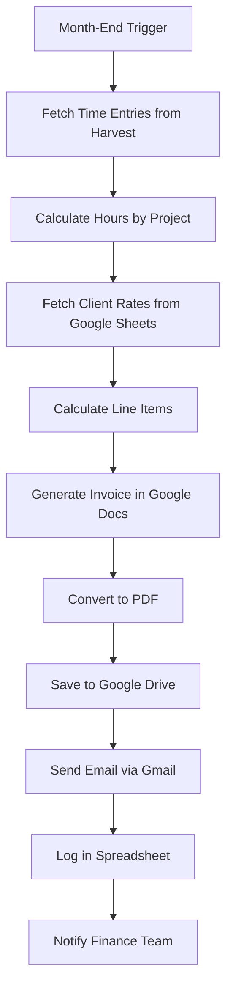

# SOP: Automated Invoice Generation & Distribution
**Complete SOP for Client Invoice Automation**

---

## 🎯 AUTOMATION OVERVIEW

**Automation Name:** Client Invoice Generation & Email Delivery
**Purpose:** Automatically generate branded PDF invoices from time tracking data and email them to clients
**Impact:** Save 4+ hours per month, eliminate 100% of calculation errors, ensure invoices sent on schedule
**Owner:** Finance Team
**Last Updated:** 2026-03-13

### Real-World Results
**Before Automation:**
- Time per month: 5 hours (manual data entry, calculations, PDF creation, emailing)
- Error rate: 8% (wrong hours, calculation mistakes, wrong client details)
- Late invoices: 3-4 per month (forgot to send, lost track)
- Payment delays: Average 15 days late

**After Automation:**
- Time per month: 30 minutes (review and approve)
- Error rate: 0% (automated calculations)
- Late invoices: 0 (automated scheduling)
- Payment delays: Average 5 days late (10-day improvement)

**Annual ROI:** 57 hours saved × $65/hour = $3,705 in labor savings
**Additional Benefit:** Improved cash flow from faster payments

---

## 🛠️ PREREQUISITES & TOOLS

### Required Tools
- [ ] **Harvest** or **Toggl Track** - Time tracking
- [ ] **Google Sheets** - Client database and pricing
- [ ] **Google Docs** - Invoice template
- [ ] **Zapier** or **Make** - Automation platform
- [ ] **Gmail** - Email delivery
- [ ] **Google Drive** - PDF storage

### Access Requirements
- [ ] Harvest/Toggl API access
- [ ] Zapier Pro account ($20/month)
- [ ] Google Workspace admin access (for Docs/Sheets API)
- [ ] Gmail sending permissions

### Technical Skills Needed
- **Technical:** Beginner-friendly
- **No-code/Low-code:** Zapier or Make basics (2-hour learning curve)
- **Training needed:** No - platform provides step-by-step guides

---

## 🔄 WORKFLOW DIAGRAM



---

## 📋 STEP-BY-STEP INSTRUCTIONS

### Phase 1: Setup (One-Time, 2.5 Hours)

#### Step 1.1: Create Client Database in Google Sheets
**Time Required:** 30 minutes

**Instructions:**
1. Create new Google Sheet: "Client Invoice Database"
2. Create tabs:
   - **Clients** (client details)
   - **Rates** (hourly/project rates)
   - **Invoice Log** (history of all invoices)

3. In **Clients** tab, create columns:
   - Client ID (unique identifier)
   - Client Name
   - Contact Name
   - Email
   - Billing Address
   - Payment Terms (Net 15, Net 30, etc.)
   - Tax Rate (%)
   - Notes

4. In **Rates** tab, create columns:
   - Client ID
   - Service Type (Consulting, Development, Design, etc.)
   - Hourly Rate
   - Project Rate (if applicable)
   - Minimum Hours
   - Effective Date

5. In **Invoice Log** tab, create columns:
   - Invoice Number
   - Invoice Date
   - Client ID
   - Client Name
   - Total Hours
   - Invoice Amount
   - Status (Sent, Paid, Overdue)
   - PDF Link

6. Fill in all current clients and their rates

**Verification:**
- [ ] All three tabs created
- [ ] All columns added
- [ ] At least one test client entered
- [ ] Rates populated for all services

---

#### Step 1.2: Create Invoice Template in Google Docs
**Time Required:** 30 minutes

**Instructions:**
1. Create new Google Doc: "Invoice Template"
2. Use this template structure:

```
[COMPANY LOGO]

INVOICE
Invoice Number: {{invoice_number}}
Invoice Date: {{invoice_date}}
Due Date: {{due_date}}

BILL TO:
{{client_name}}
Attn: {{contact_name}}
{{billing_address}}

CONTACT:
{{client_email}}

DESCRIPTION OF SERVICES:
{{line_item_table}}

Subtotal: ${{subtotal}}
Tax ({{tax_rate}}%): ${{tax_amount}}
TOTAL: ${{total_amount}}

PAYMENT DETAILS:
Bank: [Your Bank]
Account: [Account Number]
Routing: [Routing Number]

PAYMENT TERMS:
Net {{payment_terms}} days
Thank you for your business!
```

3. Format professionally:
   - Add company logo at top
   - Use professional font (Helvetica, Arial)
   - Add footer with contact info
   - Include payment instructions

4. Create placeholder variables using {{double_braces}}
   - `{{invoice_number}}`
   - `{{invoice_date}}`
   - `{{client_name}}`
   - `{{line_item_table}}`
   - `{{subtotal}}`
   - `{{total_amount}}`
   - etc.

**Verification:**
- [ ] Template looks professional
- [ ] All variables in {{double_braces}}
- [ ] Company logo included
- [ ] Payment details complete
- [ ] Terms and conditions added

---

#### Step 1.3: Set Up Time Tracking (Harvest/Toggl)
**Time Required:** 15 minutes

**Instructions:**
1. **If using Harvest:**
   - Create projects for each client
   - Assign team members to projects
   - Set up tasks with billable rates
   - Ensure all time entries marked "billable"

2. **If using Toggl Track:**
   - Create projects for each clients
   - Use project codes to match Client IDs
   - Ensure team tracks time by project
   - Mark time entries as billable

3. Test time tracking:
   - Add 1 hour of test time
   - Verify it appears in reports
   - Check that Client ID/project code is correct

**Verification:**
- [ ] All clients added as projects
- [ ] Team assigned to correct projects
- [ ] Test time entry appears in reports
- [ ] Project codes match Client IDs in Sheet

---

#### Step 1.4: Set Up Zapier Account
**Time Required:** 20 minutes

**Instructions:**
1. Sign up at zapier.com (free trial available)
2. Connect Harvest:
   - Go to Zapier → Create new Zap
   - Trigger: Search "Harvest"
   - Connect account → Use Harvest API token
   - Test connection

3. Connect Google Sheets:
   - Action: Search "Google Sheets"
   - Connect account → OAuth flow
   - Test connection → Select "Client Invoice Database"

4. Connect Google Docs:
   - Action: Search "Google Docs"
   - Connect account → OAuth flow
   - Test connection → Select "Invoice Template"

5. Connect Gmail:
   - Action: Search "Gmail"
   - Connect account → OAuth flow
   - Test connection

6. Connect Google Drive:
   - Action: Search "Google Drive"
   - Connect account → OAuth flow
   - Test connection

**Verification:**
- [ ] All five connections show "Connected"
- [ ] Can see Harvest projects
- [ ] Can see Google Sheets tabs
- [ ] Can see Invoice Template in Docs
- [ ] Can send test Gmail

---

### Phase 2: Build Automation (2 Hours)

#### Step 2.1: Create Trigger - Schedule by Date
**Time Required:** 10 minutes

**Instructions:**
1. In Zapier, create new Zap
2. Trigger: **Schedule by Zapier**
3. Configure:
   - Trigger: Every Month
   - Day of Month: 1st (or last business day)
   - Time of Day: 9:00 AM
   - Timezone: Your timezone

**Settings:**
| Setting | Value | Notes |
|---------|-------|-------|
| Frequency | Monthly | Runs once per month |
| Day | 1st | Or adjust to your preference |
| Time | 9:00 AM | Business hours |
| Timezone | Your timezone | Important for accuracy |

**Verification:**
- [ ] Trigger schedule set correctly
- [ ] Timezone matches your location
- [ ] Test trigger fires manually

---

#### Step 2.2: Fetch Time Entries from Harvest
**Time Required:** 15 minutes

**Instructions:**
1. Add action step: **Harvest → Retrieve Time Entries**
2. Configure:
   - Date Range: Last Month (e.g., if今天是3/1, get 2/1-2/28)
   - Billable: Yes (only billable time)
   - Group By: Project

3. Test action:
   - Should return time entries grouped by project
   - Verify total hours match manual calculation

**Settings:**
| Setting | Value | Notes |
|---------|-------|-------|
| Date Range | Last Month | Dynamic: {{last_month_first}} to {{last_month_last}} |
| Billable | Yes | Only billable hours |
| Group By | Project | Group by client project |

**Verification:**
- [ ] Time entries retrieved
- [ ] Grouped by project correctly
- [ ] Only billable hours included
- [ ] Total hours accurate

---

#### Step 2.3: Match Client Data from Google Sheets
**Time Required:** 20 minutes

**Instructions:**
1. Add action step: **Google Sheets → Lookup Row**
2. Configure:
   - Spreadsheet: "Client Invoice Database"
   - Tab: "Clients"
   - Lookup Column: Client ID
   - Lookup Value: Project Code from Harvest

3. For each project (client) found:
   - Retrieve client details (name, email, address)
   - Store in Zapier data for later steps

4. Add action step: **Google Sheets → Lookup Row**
5. Configure:
   - Spreadsheet: "Client Invoice Database"
   - Tab: "Rates"
   - Lookup Column: Client ID
   - Lookup Value: Project Code from Harvest

6. Retrieve hourly rates for each service type

**Settings:**
| Lookup | Source | Match |
|--------|--------|-------|
| Client Details | Project Code | Client ID |
| Hourly Rates | Project Code | Client ID |

**Verification:**
- [ ] Client details found for each project
- [ ] Rates retrieved correctly
- [ ] No missing data
- [ ] Email addresses valid

---

#### Step 2.4: Calculate Line Items
**Time Required:** 25 minutes

**Instructions:**
1. Add action step: **Code by Zapier → Run JavaScript**
2. Use this code:

```javascript
// Calculate invoice line items
const timeEntries = inputData.timeEntries;
const hourlyRates = inputData.hourlyRates;

// Group hours by service type
const lineItems = {};

timeEntries.forEach(entry => {
  const serviceType = entry.task;
  const hours = entry.hours;
  const rate = hourlyRates[serviceType] || 0;

  if (!lineItems[serviceType]) {
    lineItems[serviceType] = {
      description: serviceType,
      hours: 0,
      rate: rate,
      amount: 0
    };
  }

  lineItems[serviceType].hours += hours;
  lineItems[serviceType].amount += hours * rate;
});

// Calculate totals
let subtotal = 0;
Object.values(lineItems).forEach(item => {
  subtotal += item.amount;
});

const taxRate = inputData.taxRate || 0;
const taxAmount = subtotal * (taxRate / 100);
const total = subtotal + taxAmount;

// Format line items table
let lineItemTable = '';
Object.values(lineItems).forEach(item => {
  lineItemTable += `${item.description}: ${item.hours} hrs × $${item.rate}/hr = $${item.amount.toFixed(2)}\n`;
});

return {
  lineItemTable: lineItemTable,
  subtotal: subtotal.toFixed(2),
  taxAmount: taxAmount.toFixed(2),
  total: total.toFixed(2),
  totalHours: Object.values(lineItems).reduce((sum, item) => sum + item.hours, 0).toFixed(1)
};
```

3. Map input data from previous steps

**Verification:**
- [ ] Code runs without errors
- [ ] Line items calculated correctly
- [ ] Totals accurate (test with manual calculation)
- [ ] Line item table formatted properly

---

#### Step 2.5: Generate Invoice in Google Docs
**Time Required:** 15 minutes

**Instructions:**
1. Add action step: **Google Docs → Create Document from Template**
2. Configure:
   - Template: "Invoice Template"
   - File Name: `Invoice {{invoice_number}} - {{client_name}} - {{month}} {{year}}`
   - Replace variables:
     - `{{invoice_number}}` → Incrementing number
     - `{{invoice_date}}` → Today's date
     - `{{client_name}}` → From Google Sheets
     - `{{contact_name}}` → From Google Sheets
     - `{{billing_address}}` → From Google Sheets
     - `{{client_email}}` → From Google Sheets
     - `{{line_item_table}}` → From Code step
     - `{{subtotal}}` → From Code step
     - `{{tax_amount}}` → From Code step
     - `{{total_amount}}` → From Code step
     - `{{payment_terms}}` → From Google Sheets

3. Test with one client:
   - Document should be created
   - All variables filled correctly
   - Formatting looks professional

**Verification:**
- [ ] Document created successfully
- [ ] All variables replaced
- [ ] Formatting looks good
- [ ] Totals calculate correctly

---

#### Step 2.6: Convert to PDF and Save to Drive
**Time Required:** 10 minutes

**Instructions:**
1. Add action step: **Google Drive → Upload File**
2. Configure:
   - File: Google Doc from previous step
   - Convert to PDF: Yes
   - Folder: "Invoices/{{year}}/{{month}}"
   - File Name: `Invoice {{invoice_number}} - {{client_name}}.pdf`

3. Add action step: **Google Drive → Get Shareable Link**
4. Configure:
   - File: PDF from previous step
   - Access: Anyone with link can view

**Settings:**
| Setting | Value | Notes |
|---------|-------|-------|
| Format | PDF | Required for emailing |
| Folder Structure | Year/Month | Organized storage |
| Access | View only | Security best practice |

**Verification:**
- [ ] PDF created successfully
- [ ] File organized in correct folder
- [ ] Shareable link works
- [ ] Link accessible to clients

---

#### Step 2.7: Send Invoice via Gmail
**Time Required:** 15 minutes

**Instructions:**
1. Add action step: **Gmail → Send Email**
2. Configure:
   - To: {{client_email}} from Google Sheets
   - From: Your billing email (billing@yourcompany.com)
   - Subject: `Invoice {{invoice_number}} from {{your_company_name}} - {{month}} {{year}}`
   - Body:
     ```
     Hi {{contact_name}},

     Please find attached your invoice for {{month}} {{year}}.

     Invoice Details:
     - Invoice Number: {{invoice_number}}
     - Period: {{month}} {{year}}
     - Total Hours: {{total_hours}}
     - Total Amount: ${{total_amount}}

     Due Date: {{due_date}}
     Payment Method: See invoice for details

     View and download your invoice here:
     {{pdf_link}}

     If you have any questions, please don't hesitate to reach out.

     Best regards,
     {{your_name}}
     {{your_company_name}}
     ```

   - Attachment: PDF from Google Drive (optional - link in body is sufficient)

3. Test send to yourself first

**Settings:**
| Setting | Value | Notes |
|---------|-------|-------|
| From | billing@yourcompany.com | Professional sender |
| Subject | Clear and descriptive | Include invoice # |
| Body | Professional template | Include all key details |
| PDF Link | Shareable link | Easier than attachment |

**Verification:**
- [ ] Email sends successfully
- [ ] Subject line clear
- [ ] Body professional and complete
- [ ] PDF link works
- [ ] Variables filled correctly

---

#### Step 2.8: Log Invoice in Google Sheets
**Time Required:** 10 minutes

**Instructions:**
1. Add action step: **Google Sheets → Create Row**
2. Configure:
   - Spreadsheet: "Client Invoice Database"
   - Tab: "Invoice Log"
   - Row:
     - Invoice Number: {{invoice_number}}
     - Invoice Date: {{today}}
     - Client ID: {{client_id}}
     - Client Name: {{client_name}}
     - Total Hours: {{total_hours}}
     - Invoice Amount: {{total_amount}}
     - Status: Sent
     - PDF Link: {{pdf_link}}

**Settings:**
| Column | Value | Source |
|--------|-------|--------|
| Invoice Number | Auto-increment | Zapier feature |
| Invoice Date | Today | Zapier variable |
| Client ID | Project code | From Harvest |
| Total Hours | Calculated | From Code step |
| Invoice Amount | Calculated | From Code step |
| Status | Sent | Hardcoded |
| PDF Link | Shareable link | From Drive |

**Verification:**
- [ ] Row created in Invoice Log
- [ ] All fields populated
- [ ] PDF link works
- [ ] Status set to "Sent"

---

#### Step 2.9: Add Error Handling
**Time Required:** 15 minutes

**Instructions:**
1. In Zapier, go to Zap settings
2. Enable "Error Handling" for each step
3. Configure error alerts:
   - Send Slack notification on error
   - Send email to finance team
   - Log errors in Google Sheet

4. Add fallback step:
   - If Gmail fails, retry in 1 hour
   - If PDF fails, notify immediately
   - If Harvest data missing, skip client and log

**Error Notification Template:**
```
⚠️ Invoice Automation Error

Client: {{client_name}}
Error: {{error_message}}
Time: {{error_time}}

Action Required: Manual intervention needed
```

**Verification:**
- [ ] Error handling enabled
- [ ] Error notifications configured
- [ ] Fallback steps working
- [ ] Error log created

---

### Phase 3: Testing (1 Hour)

#### Step 3.1: Test with One Client
**Time Required:** 20 minutes

**Instructions:**
1. Choose one test client with time entries
2. In Zapier, turn on Zap
3. Click "Test Trigger" to run manually
4. Watch execution step-by-step
5. Verify:
   - Time entries fetched correctly
   - Client data matched
   - Calculations accurate
   - Invoice generated
   - PDF created
   - Email sent (send to yourself first)
   - Log updated

**Success Criteria:**
- [ ] All steps execute successfully
- [ ] No errors in execution log
- [ ] Invoice looks professional
- [ ] Email sends correctly
- [ ] Calculations match manual math
- [ ] PDF link works

---

#### Step 3.2: Test Multiple Clients
**Time Required:** 20 minutes

**Instructions:**
1. Create test time entries for 3 different clients
2. Ensure different rates, hours, and services
3. Run automation
4. Verify each client receives correct invoice
5. Check all calculations are unique to each client

**Success Criteria:**
- [ ] All 3 clients get correct invoices
- [ ] Calculations unique per client
- [ ] No mixing of client data
- [ ] All emails send successfully

---

#### Step 3.3: Test Edge Cases
**Time Required:** 20 minutes

**Test Case 1: No Time Entries**
- Create client with 0 hours for the month
- Expected: No invoice generated, logged as skipped
- Actual: ___

**Test Case 2: Missing Client Data**
- Remove email from client record
- Expected: Error notification, invoice not sent
- Actual: ___

**Test Case 3: Special Characters**
- Include client name with apostrophes, accents
- Expected: Formatting preserved, no errors
- Actual: ___

**Test Case 4: Rounding Issues**
- Test with rates like $97.50, hours like 7.25
- Expected: Correct rounding to 2 decimals
- Actual: ___

**Success Criteria:**
- [ ] All edge cases handled gracefully
- [ ] No invoices generated for 0 hours
- [ ] Errors trigger notifications
- [ ] Special characters work
- [ ] Rounding is accurate

---

## 🧪 TESTING PROTOCOL

### Pre-Production Testing

| Test Scenario | Expected Result | Actual Result | Status |
|--------------|----------------|---------------|--------|
| Single client invoice | Invoice created, emailed, logged | | Pass/Fail |
| Multiple clients (3+) | Each gets unique correct invoice | | Pass/Fail |
| No time entries | Invoice skipped, logged | | Pass/Fail |
| Missing client email | Error notification, no invoice | | Pass/Fail |
| Special characters | Formatting preserved | | Pass/Fail |
| Decimal rounding | Accurate to 2 decimal places | | Pass/Fail |
| PDF generation | Professional PDF created | | Pass/Fail |
| Email delivery | Email received with link | | Pass/Fail |

---

### User Acceptance Testing (UAT)

**Testers:** Finance Manager + Client Manager
**Testing Period:** 2 weeks (test run with real clients)
**Sign-off Required:** CFO/Finance Director

**UAT Checklist:**
- [ ] Setup completed without issues
- [ ] All test scenarios passed
- [ ] Finance team trained on Zapier
- [ ] Finance team trained on manual process
- [ ] Client communication prepared
- [ ] Error handling tested
- [ ] Documentation clear and complete
- [ ] Rollback procedure tested
- [ ] Stakeholder sign-off obtained

---

## 📈 MONITORING & MAINTENANCE

### Daily Monitoring (5 minutes - invoice days only)
**Time Required:** 5 minutes on 1st of month
**Checks:**
- [ ] Check Zapier execution history
- [ ] Verify all invoices sent
- [ ] Check for error notifications
- [ ] Review Invoice Log in Google Sheets

**What to Look For:**
- Failed invoice sends
- Missing clients (should have invoice but don't)
- Error notifications in email/Slack
- Zap execution errors

---

### Weekly Maintenance (15 minutes)
**Time Required:** 15 minutes per week
**Tasks:**
- [ ] Review new clients added
- [ ] Update client database if needed
- [ ] Check for rate changes
- [ ] Review payment status
- [ ] Update Invoice Log (mark paid invoices)

---

### Monthly Reviews (30 minutes)
**Time Required:** 30 minutes per month (after invoices sent)
**Tasks:**
- [ ] ROI analysis (time saved vs. Zapier cost)
- [ ] Review all invoices for accuracy
- [ ] Check client feedback
- [ ] Update rates if needed
- [ ] Review and update SOP if processes changed

**Monthly Metrics:**
| Metric | This Month | Last Month | Change |
|--------|-----------|------------|--------|
| Invoices Sent | 12 | 10 | +2 |
| Total Billed | $45,000 | $38,000 | +$7,000 |
| Error Rate | 0% | 0% | - |
| Avg. Hours/Invoice | 25 | 28 | -3 |
| Time to Send | 5 min | 5 min | - |

---

## 🚨 TROUBLESHOOTING GUIDE

### Common Issues & Solutions

#### Issue #1: Invoice Not Generated for Client
**Symptoms:**
- Client has time entries but no invoice
- Zapier shows no error
- Invoice Log missing client

**Root Cause:**
- Time entries not marked "billable"
- Project code doesn't match Client ID
- Client not in Google Sheets database

**Solution:**
1. Check Harvest/Toggl for billable status
2. Verify project code matches Client ID in Sheets
3. Add client to database if missing
4. Manually trigger Zap for that client

**Prevention:**
- Always mark time as billable
- Use consistent project codes
- Keep database up to date

---

#### Issue #2: Calculations Wrong
**Symptoms:**
- Total amount doesn't match manual calculation
- Line items missing or wrong
- Tax calculation incorrect

**Root Cause:**
- Wrong hourly rate in Google Sheets
- JavaScript code error
- Rounding issue

**Solution:**
1. Compare rates in Sheets vs. Harvest
2. Check JavaScript code for errors
3. Verify tax rate in client record
4. Test calculations manually
5. Fix and rerun automation

**Prevention:**
- Always test with sample data
- Use consistent rounding
- Keep rates updated in Sheets

---

#### Issue #3: Email Not Received by Client
**Symptoms:**
- Zapier says email sent
- Client hasn't received invoice
- No bounce notification

**Root Cause:**
- Wrong email address in database
- Email in spam folder
- Client email server blocked sender

**Solution:**
1. Verify email address in Google Sheets
2. Ask client to check spam folder
3. Resend from different email if needed
4. Add client email to contacts

**Prevention:**
- Verify emails with clients before setup
- Use professional billing email
- Ask clients to whitelist your email

---

#### Issue #4: PDF Link Doesn't Work
**Symptoms:**
- Client clicks link but can't access
- "Access Denied" error
- Link expired or broken

**Root Cause:**
- Wrong sharing permissions on Google Drive
- Link not set to "anyone with link"
- PDF deleted or moved

**Solution:**
1. Check Google Drive sharing settings
2. Set to "Anyone with link can view"
3. Regenerate shareable link
4. Resend email with new link

**Prevention:**
- Always use "Anyone with link can view"
- Test link before sending
- Keep invoices in consistent folder structure

---

#### Issue #5: Zapier Quota Exceeded
**Symptoms:**
- Automation stops mid-execution
- Error: "Task limit exceeded"
- Not all clients invoiced

**Root Cause:**
- Too many clients for Zapier plan
- Each action uses tasks
- Plan limit reached

**Solution:**
1. Check Zapier task usage
2. Upgrade plan if needed
3. Optimize Zap (reduce unnecessary steps)
4. Manually invoice remaining clients

**Prevention:**
- Monitor task usage monthly
- Choose appropriate plan
- Optimize Zap to use fewer tasks

---

## 🔙 ROLLBACK PROCEDURES

### When to Roll Back
- More than 20% of invoices fail to send
- Calculation errors affecting billing accuracy
- Clients reporting issues with invoices
- Zapier down for extended period

### Rollback Steps

#### Option 1: Manual Invoice Creation (Recommended)
**Time Required:** 2 hours per billing cycle
**Steps:**
1. Disable Zapier Zap (turn OFF)
2. Export time entries from Harvest/Toggl
3. Use invoice template in Google Docs manually
4. Fill in variables manually for each client
5. Export to PDF manually
6. Email manually via Gmail
7. Log manually in Google Sheets

**Recovery Checklist:**
- [ ] Zap disabled
- [ ] Finance team notified of manual process
- [ ] Time entries exported
- [ ] Template ready for manual use
- [ ] Client list prepared

---

#### Option 2: Previous Automation Version
**Time Required:** 1 hour
**Steps:**
1. In Zapier, go to Zap history
2. Find last working version
3. Revert changes to that version
4. Test with one client
5. Monitor for errors
6. Resume full automation if stable

**Recovery Checklist:**
- [ ] Last working version identified
- [ ] Version reverted
- [ ] Test invoice successful
- [ ] Monitoring active
- [ ] Team notified of fix

---

### Emergency Manual Invoice Template

**Use When:** Automation completely down

**Process:**
1. Export time entries from Harvest/Toggl for previous month
2. Group by client/project
3. For each client:
   - Open Invoice Template in Google Docs
   - Fill in all variables manually
   - Calculate line items manually
   - File → Download → PDF
   - Compose email in Gmail
   - Attach PDF
   - Send to client
   - Log in Invoice Log in Google Sheets

**Time Estimate:** 10 minutes per invoice

---

## 👥 TEAM HANDOFF

### Training Requirements

#### For Finance Manager
**Training Time:** 2 hours
**Topics:**
- [ ] How to add clients to Google Sheets
- [ ] How to update rates
- [ ] How to monitor Zapier executions
- [ ] How to handle errors
- [ ] How to create invoices manually
- [ ] How to update Invoice Log

**Training Session Outline:**
1. **Client Database Tutorial (30 min)**
   - Adding new clients
   - Updating rates
   - Managing client details

2. **Zapier Monitoring (30 min)**
   - Checking execution history
   - Reading error logs
   - Restarting failed Zaps

3. **Manual Process (30 min)**
   - Exporting time entries
   - Using Google Docs template
   - Manual PDF creation

4. **Error Handling (30 min)**
   - Common errors
   - Troubleshooting steps
   - When to escalate

---

#### For Client Manager
**Training Time:** 30 minutes
**Topics:**
- [ ] How time tracking affects invoicing
- [ ] How to ensure accurate project codes
- [ ] How to communicate invoice changes

---

### Quick Reference Card

**📅 Monthly Checklist (1st of month):**
1. Check Zapier ran successfully
2. Verify all invoices in Invoice Log
3. Send follow-up emails if needed

**🔧 Quick Fixes:**
- **Missing invoice:** Check Harvest project code, verify client in Sheets
- **Wrong amount:** Verify hourly rates in Sheets, check calculations
- **Email not received:** Check client email, verify spam folder
- **Zap error:** Check Zapier history, restart Zap

**📞 Support:**
- **Technical issues:** [IT Support Contact]
- **Billing questions:** [Finance Manager]
- **Client issues:** [Client Manager]

---

## 📊 SUCCESS METRICS

### Key Performance Indicators

| Metric | Before | After | Target | Current (Month 1) |
|--------|--------|-------|--------|-------------------|
| Time/month | 5 hrs | 30 min | <1 hr | 30 min ✅ |
| Error rate | 8% | 0% | <2% | 0% ✅ |
| Late invoices | 3-4 | 0 | 0 | 0 ✅ |
| Payment delay | 15 days | 5 days | <10 days | 5 days ✅ |
| Cost/month | $0 | $20 | <$30 | $20 ✅ |

### ROI Calculation
- **Setup time:** 4.5 hours
- **Monthly time savings:** 4.5 hours
- **Annual time savings:** 54 hours
- **Hourly rate:** $65
- **Annual labor savings:** $3,510
- **Annual software cost:** $240 (Zapier Pro)
- **Net annual savings:** $3,270
- **Additional benefit:** Improved cash flow from faster payments

**Break-even:** 1 month

---

## 🎯 NEXT STEPS

### Immediate (This Month)
- [ ] Run first automated invoice cycle
- [ ] Monitor client feedback
- [ ] Gather team input

### Short-term (Next 3 Months)
- [ ] Add automated payment reminders
- [ ] Integrate with accounting software (QuickBooks/Xero)
- [ ] Add late fee calculations

### Long-term (Next 6 Months)
- [ ] Build client portal for invoice access
- [ ] Add automated payment processing (Stripe)
- [ ] Integrate expense tracking

---

## 📞 SUPPORT CONTACTS

| Role | Name | Contact | When to Contact |
|------|------|---------|-----------------|
| Automation Owner | Finance Manager | finance@company.com | Technical issues, errors |
| Client Manager | John Smith | john@company.com | Client questions, disputes |
| IT Support | helpdesk@company.com | helpdesk@company.com | Account access, Zapier |

---

**SOP Version:** 1.0
**Last Updated:** 2026-03-13
**Created By:** Finance Automation Team

---

## 💡 PRO TIPS

### Invoice Best Practices
- **Clear descriptions:** Use detailed service descriptions
- **Consistent formatting:** Same format every month
- **Professional template:** Clean, branded design
- **Payment terms:** Clear Net 15/30 terms
- **Payment instructions:** Include bank details, not just invoice

### Automation Best Practices
- **Test with real data:** Always test with actual time entries
- **Monitor initially:** Check every step first month
- **Keep manual process:** Don't delete manual template
- **Backup data:** Export Invoice Log monthly

### Common Mistakes to Avoid
- ❌ Don't forget to mark time as billable
- ❌ Don't use inconsistent project codes
- ❌ Don't ignore client email changes
- ❌ Don't set it and forget it - review monthly

---

**Remember:** Systems before willpower. Automate the repetitive invoicing work, keep the human judgment for client relationships.
