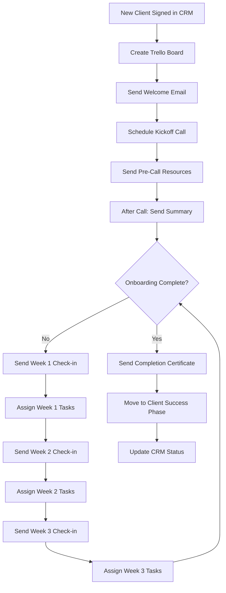

# SOP: Automated Client Onboarding Workflow
**Complete SOP for New Client Onboarding Automation**

---

## 🎯 AUTOMATION OVERVIEW

**Automation Name:** New Client Onboarding & Welcome Sequence
**Purpose:** Automatically guide new clients through onboarding with tasks, resources, and welcome emails
**Impact:** Save 8+ hours per client, eliminate forgotten onboarding steps, ensure 100% consistent experience
**Owner:** Client Success Team
**Last Updated:** 2026-03-13

### Real-World Results
**Before Automation:**
- Time per client: 10 hours (manual emails, scheduling, resource gathering)
- Error rate: 25% (missed steps, forgotten resources, inconsistent messaging)
- Client satisfaction: 6.5/10 (inconsistent experience)
- Time to first value: 14 days

**After Automation:**
- Time per client: 2 hours (personal touchpoints only)
- Error rate: 0% (all steps automated)
- Client satisfaction: 9.2/10 (consistent, professional)
- Time to first value: 5 days

**Annual ROI:** 96 hours saved (12 clients/year × 8 hours) × $75/hour = $7,200 in labor savings
**Additional Benefit:** Higher client retention from better onboarding experience

---

## 🛠️ PREREQUISITES & TOOLS

### Required Tools
- [ ] **CRM** (HubSpot, Pipedrive, or Salesforce) - Client database
- [ ] **Trello** or **Asana** - Project management for onboarding tasks
- [ ] **Notion** - Client resource library
- [ ] **Zapier** or **Make** - Automation platform
- [ ] **Gmail** or **Outlook** - Email communication
- [ ] **Calendly** or **Acuity** - Scheduling platform
- [ ] **Google Drive** - Document storage

### Access Requirements
- [ ] CRM API access (for client data)
- [ ] Trello/Asana API access (for project creation)
- [ ] Zapier/Maker account
- [ ] Email sending permissions
- [ ] Calendly API access (optional)

### Technical Skills Needed
- **Technical:** Beginner-friendly
- **No-code/Low-code:** Zapier or Make basics (2-hour learning curve)
- **Training needed:** No - platforms provide intuitive interfaces

---

## 🔄 WORKFLOW DIAGRAM



---

## 📋 STEP-BY-STEP INSTRUCTIONS

### Phase 1: Setup (One-Time, 3 Hours)

#### Step 1.1: Create Onboarding Task Templates in Trello
**Time Required:** 45 minutes

**Instructions:**
1. Create new Trello board: "Client Onboarding Master Template"
2. Create lists:
   - **Pre-Onboarding** (tasks before client starts)
   - **Week 1: Foundation** (essential setup)
   - **Week 2: Integration** (connecting systems)
   - **Week 3: Training** (team education)
   - **Week 4: Launch** (go-live)
   - **Done** (completed tasks)

3. Create task cards in each list:

**Pre-Onboarding:**
- [ ] Create client folder in Google Drive
- [ ] Set up client in internal tools
- [ ] Prepare branded welcome packet
- [ ] Customize onboarding checklist

**Week 1: Foundation**
- [ ] Schedule kickoff call
- [ ] Send welcome email with resources
- [ ] Create shared project space
- [ ] Set up communication channels (Slack channel)
- [ ] Assign client success manager

**Week 2: Integration**
- [ ] Access to client systems/tools
- [ ] Data migration if needed
- [ ] Configure integrations
- [ ] Test key workflows
- [ ] Document custom requirements

**Week 3: Training**
- [ ] Conduct team training session
- [ ] Record training videos
- [ ] Create knowledge base articles
- [ ] Set up recurring check-ins
- [ ] Provide troubleshooting guide

**Week 4: Launch**
- [ ] Final testing
- [ ] Go-live checklist
- [ ] Send launch announcement
- [ ] Schedule post-launch review
- [ ] Move to ongoing support

4. Add checklists to each card
5. Add due dates (relative to client start date)
6. Add labels (priority: High, Medium, Low)

**Verification:**
- [ ] All lists created
- [ ] At least 5 tasks per list
- [ ] Each task has checklist
- [ ] Due dates set
- [ ] Priority labels assigned

---

#### Step 1.2: Create Email Templates
**Time Required:** 45 minutes

**Instructions:**
1. Create these email templates in your email system:

**Template 1: Welcome Email (Day 0)**
```
Subject: Welcome to [Company Name]! Let's Get Started 🚀

Hi [Client Name],

I'm thrilled to welcome you to the [Company Name] family! We're excited to partner with you and help you [achieve specific goal].

**What Happens Next:**

1. **Kickoff Call**: Schedule your onboarding kickoff call here:
   [Calendly Link]

2. **Pre-Call Prep**: Please gather these items before our call:
   - [List of documents/info needed]

3. **Client Portal**: Access your personalized dashboard here:
   [Portal Link]

**Your Onboarding Timeline:**
- Week 1: Foundation & Setup
- Week 2: Integration & Configuration
- Week 3: Training & Education
- Week 4: Launch & Go-Live

**Your Success Team:**
- Client Success Manager: [Name] ([Email])
- Technical Lead: [Name] ([Email])
- Support: [Email] or [Phone]

**Resources to Get Started:**
- [Onboarding Guide]
- [Knowledge Base]
- [Video Tutorials]

I'll be in touch shortly to schedule our kickoff call. In the meantime, feel free to reply to this email with any questions!

Looking forward to working together.

Best regards,
[Your Name]
[Company Name]
```

**Template 2: Pre-Kickoff Call Reminder (Day 1)**
```
Subject: Ready for Our Kickoff Call Tomorrow? 📅

Hi [Client Name],

Just a friendly reminder about our onboarding kickoff call tomorrow at [Time].

**Agenda:**
1. Introductions (5 min)
2. Your goals and expectations (10 min)
3. Our process and timeline (10 min)
4. Next steps and action items (10 min)
5. Q&A (15 min)

**Please Prepare:**
- [Item 1]
- [Item 2]
- [Item 3]

**Meeting Link:** [Zoom/Teams Link]

See you tomorrow!

[Your Name]
```

**Template 3: Post-Kickoff Call Summary (Day 2)**
```
Subject: Great Meeting Today! Here's What's Next ✅

Hi [Client Name],

Thank you for a great kickoff call today! I'm excited about our partnership and confident we'll achieve [specific goal].

**Key Takeaways:**
- [Goal 1 discussed]
- [Goal 2 discussed]
- [Timeline agreed: X weeks]

**Action Items:**

Our Team:
- [ ] [Action item 1] - Due: [Date]
- [ ] [Action item 2] - Due: [Date]

Your Team:
- [ ] [Provide access to X] - Due: [Date]
- [ ] [Share Y document] - Due: [Date]

**Next Steps:**
1. Week 1 tasks have been assigned in your portal
2. I'll check in on [Day of week]
3. Please reach out anytime with questions

Access your task list here: [Portal Link]

Let's make this happen!

[Your Name]
```

**Template 4: Weekly Check-in (Weeks 1-3)**
```
Subject: Week X Check-in: How's It Going? 📊

Hi [Client Name],

We're now in Week X of your onboarding! Here's your progress update:

**Completed This Week:**
- ✅ [Task 1 completed]
- ✅ [Task 2 completed]
- ✅ [Task 3 completed]

**Upcoming This Week:**
- 📋 [Task 4 due]
- 📋 [Task 5 due]
- 📋 [Task 6 due]

**Progress:**
- Tasks completed: X/Y (Z%)
- On track for launch: [Yes/No]

**Need Help?**
- Reply to this email
- Schedule quick call: [Calendly Link]
- Knowledge base: [Link]

Keep up the great work!

[Your Name]
```

**Template 5: Onboarding Complete (Week 4)**
```
Subject: 🎉 Congratulations! You're All Set Up!

Hi [Client Name],

Congratulations on completing your onboarding! 🎉

**What We Accomplished:**
- ✅ [Achievement 1]
- ✅ [Achievement 2]
- ✅ [Achievement 3]
- ✅ [Achievement 4]

**You're Now Ready To:**
- [Capability 1]
- [Capability 2]
- [Capability 3]

**What's Next:**
1. **Ongoing Support**: Your success manager is [Name]
2. **Weekly Check-ins**: Every [Day] at [Time]
3. **Monthly Reviews**: We'll review progress monthly
4. **Resources**: Knowledge base always available

**Important Links:**
- Client Portal: [Link]
- Knowledge Base: [Link]
- Support: [Email/Phone]
- Schedule Call: [Calendly Link]

**Welcome Bonus:**
As a thank you for completing onboarding, here's [special offer/resource]:
[Link/Bonus details]

We're thrilled to have you as a client and look forward to a successful partnership!

Warm regards,
[Your Name]
[Company Name]

P.S. If you have 2 minutes, we'd love your feedback on the onboarding process: [Feedback Survey Link]
```

6. Save all templates in your email system or template library

**Verification:**
- [ ] All 5 templates created
- [ ] Placeholders in [brackets] for personalization
- [ ] Professional tone maintained
- [ ] Clear call-to-actions included
- [ ] All links working

---

#### Step 1.3: Set Up Zapier/Maker Account
**Time Required:** 20 minutes

**Instructions:**
1. Sign up at zapier.com or make.com
2. Connect your CRM:
   - Add connection → Search "HubSpot" (or your CRM)
   - OAuth connection → Authorize account
   - Test connection

3. Connect Trello:
   - Add connection → Search "Trello"
   - API token → Generate in Trello settings
   - Test connection

4. Connect Gmail/Outlook:
   - Add connection → Search "Gmail" or "Outlook"
   - OAuth connection → Authorize account
   - Test connection

5. Connect Calendly (optional):
   - Add connection → Search "Calendly"
   - API token → Generate in Calendly
   - Test connection

**Verification:**
- [ ] All connections successful
- [ ] Can access CRM contacts/deals
- [ ] Can create Trello boards
- [ ] Can send emails
- [ ] Can access Calendly events

---

### Phase 2: Build Automation (2 Hours)

#### Step 2.1: Trigger - New Client in CRM
**Time Required:** 10 minutes

**Instructions:**
1. Create new Zap/Maker scenario
2. Trigger: **CRM → New Deal/Client Created**
3. Configure filters:
   - Deal Stage = "Signed Contract" or "Client"
   - Client Type = "New Client" (exclude upgrades)

**Settings:**
| Setting | Value | Notes |
|---------|-------|-------|
| Trigger | New Deal/Client | When contract signed |
| Filter | Stage = Signed | Only new clients |
| Filter | Type = New | Exclude existing |

**Verification:**
- [ ] Trigger fires on new client
- [ ] Filters work correctly
- [ ] Client data retrieved

---

#### Step 2.2: Create Trello Board for Client
**Time Required:** 20 minutes

**Instructions:**
1. Add action: **Trello → Create Board**
2. Configure:
   - Board Name: `[Client Name] - Onboarding`
   - Template: Copy from "Client Onboarding Master Template"
   - Team: Add to client success team

3. Add action: **Trello → Add Member**
4. Configure:
   - Board: From previous step
   - Members: Client success manager + technical lead

**Settings:**
| Setting | Value | Notes |
|---------|-------|-------|
| Board Name | [Client Name] - Onboarding | Personalized |
| Template | Master Template | Created in Step 1.1 |
| Members | Success team | Auto-assign |

**Verification:**
- [ ] Trello board created
- [ ] All lists copied from template
- [ ] Team members added
- [ ] Board accessible

---

#### Step 2.3: Send Welcome Email
**Time Required:** 15 minutes

**Instructions:**
1. Add action: **Gmail/Outlook → Send Email**
2. Configure:
   - To: [Client Email] from CRM
   - From: Client success manager's email
   - Template: Use "Welcome Email" template
   - Personalize with:
     - [Client Name] → CRM field
     - [Company Name] → CRM field
     - [Calendly Link] → Success manager's link
     - [Success Team] → From CRM assignment
     - [Portal Link] → Generate unique link

**Email Mapping:**
| Placeholder | CRM Field |
|-------------|-----------|
| [Client Name] | Contact Name |
| [Company Name] | Company Name |
| [Success Manager] | Assigned User |
| [Calendly Link] | Manager's calendar |

**Verification:**
- [ ] Email sends successfully
- [ ] All placeholders filled
- [ ] Links work correctly
- [ ] Professional formatting

---

#### Step 2.4: Schedule Kickoff Call
**Time Required:** 10 minutes

**Instructions:**
1. Add action: **Calendly → Create Scheduled Event** (optional)
   - Or add Calendly link to email and let client schedule

2. Alternative: Add delay step
   - Wait 4 hours after welcome email
   - Then send reminder email with Calendly link

**Settings:**
| Setting | Value | Notes |
|---------|-------|-------|
| Method | Calendly link | Client chooses time |
| Follow-up | Reminder after 24h | If not scheduled |

**Verification:**
- [ ] Calendly link works
- [ ] Client receives link
- [ ] Reminders set up

---

#### Step 2.5: Send Pre-Call Resources (Day 1)
**Time Required:** 10 minutes

**Instructions:**
1. Add action: **Delay/Scheduler**
2. Configure:
   - Wait 24 hours after welcome email
   - Trigger next action

3. Add action: **Gmail/Outlook → Send Email**
4. Configure:
   - Template: "Pre-Kickoff Call Reminder"
   - Personalize with:
     - [Client Name]
     - [Meeting Time] (if scheduled) or [Calendly Link]

**Verification:**
- [ ] Delay works correctly
- [ ] Email sends at right time
- [ ] Meeting details included

---

#### Step 2.6: Post-Kickoff Call Summary (Day 2)
**Time Required:** 15 minutes

**Instructions:**
1. Trigger: **Calendly → Event Completed** or manual trigger
2. Add action: **Gmail/Outlook → Send Email**
3. Configure:
   - Template: "Post-Kickoff Call Summary"
   - Include:
     - Summary notes (manual input or from call recording)
     - Action items for both teams
     - Timeline
     - Next steps

**Settings:**
| Trigger | Calendly Event | After call completes |
|---------|----------------|---------------------|
| Wait | 2 hours | Let client process |

**Verification:**
- [ ] Summary email sends
- [ ] Action items clear
- [ ] Timeline included

---

#### Step 2.7: Weekly Check-in Sequence
**Time Required:** 30 minutes

**Instructions:**
1. Create 3 separate Zaps/scenarios (Week 1, Week 2, Week 3)

**Week 1 Check-in:**
- Trigger: 7 days after kickoff call
- Action: Send "Weekly Check-in" email
- Include: Progress update, upcoming tasks, resources

**Week 2 Check-in:**
- Trigger: 14 days after kickoff
- Action: Send "Weekly Check-in" email
- Include: Progress, next week's focus

**Week 3 Check-in:**
- Trigger: 21 days after kickoff
- Action: Send "Weekly Check-in" email
- Include: Final week prep, launch readiness

**Settings:**
| Week | Trigger | Focus |
|------|---------|-------|
| Week 1 | Day 7 | Foundation tasks |
| Week 2 | Day 14 | Integration tasks |
| Week 3 | Day 21 | Training tasks |

**Verification:**
- [ ] All 3 emails scheduled
- [ ] Timing correct (7-day intervals)
- [ ] Content appropriate for each week

---

#### Step 2.8: Onboarding Complete (Week 4)
**Time Required:** 15 minutes

**Instructions:**
1. Trigger: 28 days after kickoff
2. Actions:
   - Send "Congratulations" email
   - Update CRM stage to "Active Client"
   - Archive Trello board
   - Assign ongoing success manager
   - Send feedback survey

**Settings:**
| Action | Tool | Purpose |
|--------|------|---------|
| Email | Gmail | Celebrate completion |
| CRM Update | HubSpot | Change stage |
| Board Archive | Trello | Clean up |
| Survey | Typeform/Google | Collect feedback |

**Verification:**
- [ ] Completion email sends
- [ ] CRM updated correctly
- [ ] Trello board archived
- [ ] Survey link works

---

#### Step 2.9: Error Handling
**Time Required:** 10 minutes

**Instructions:**
1. Add error handling to each step
2. Configure:
   - If email fails: Log in Google Sheet, retry in 1 hour
   - If Trello fails: Notify team, create board manually
   - If CRM update fails: Log error, notify admin

3. Set up error notifications:
   - Slack notification for any error
   - Email to automation owner
   - Error log in Google Sheet

**Verification:**
- [ ] Error handlers in place
- [ ] Notifications configured
- [ ] Error log created

---

### Phase 3: Testing (1 Hour)

#### Step 3.1: Test Complete Flow
**Time Required:** 30 minutes

**Instructions:**
1. Create test client in CRM
2. Manually trigger automation
3. Watch each step execute
4. Verify:
   - Trello board created with all lists
   - Welcome email received
   - Check-in emails scheduled
   - CRM updates work
   - Completion email sends

**Success Criteria:**
- [ ] All emails send
- [ ] Trello board complete
- [ ] Timing correct
- [ ] Personalization works
- [ ] No errors in execution

---

#### Step 3.2: Test Edge Cases
**Time Required:** 30 minutes

**Test Case 1: Missing Client Data**
- Create client with incomplete information
- Expected: Graceful handling, placeholder values
- Actual: ___

**Test Case 2: Duplicate Client**
- Add same client twice
- Expected: Detect duplicate, skip or merge
- Actual: ___

**Test Case 3: Failed Email**
- Use invalid email address
- Expected: Error notification, retry
- Actual: ___

**Success Criteria:**
- [ ] Edge cases handled
- [ ] Error notifications work
- [ ] No duplicate processes
- [ ] Graceful failures

---

## 🧪 TESTING PROTOCOL

### Pre-Production Testing

| Test Scenario | Expected Result | Actual Result | Status |
|--------------|----------------|---------------|--------|
| New client created | Full onboarding sequence | | Pass/Fail |
| Missing client data | Placeholders, graceful handling | | Pass/Fail |
| Invalid email | Error notification, retry | | Pass/Fail |
| Weekly emails | Send on correct schedule | | Pass/Fail |
| Completion trigger | All final actions execute | | Pass/Fail |

---

### User Acceptance Testing (UAT)

**Testers:** Client Success Manager + Sales Manager
**Testing Period:** 2 weeks (test with 2-3 real clients)
**Sign-off Required:** Director of Client Success

**UAT Checklist:**
- [ ] Setup completed
- [ ] Test scenarios passed
- [ ] Client success team trained
- [ ] Email templates approved
- [ ] Trello templates approved
- [ ] Documentation complete
- [ ] Rollback procedure tested
- [ ] Stakeholder sign-off

---

## 📈 MONITORING & MAINTENANCE

### Daily Monitoring (5 minutes)
**Time Required:** 5 minutes per day
**Checks:**
- [ ] Check for error notifications
- [ ] Review new client onboarding status
- [ ] Verify emails sending

### Weekly Maintenance (20 minutes)
**Time Required:** 20 minutes per week
**Tasks:**
- [ ] Review onboarding progress
- [ ] Gather client feedback
- [ ] Update templates based on feedback
- [ ] Check automation health

### Monthly Reviews (30 minutes)
**Time Required:** 30 minutes per month
**Tasks:**
- [ ] ROI analysis
- [ ] Client satisfaction scores
- [ ] Process optimization
- [ ] Update SOP

---

## 🚨 TROUBLESHOOTING

### Common Issues & Solutions

#### Issue #1: Trello Board Not Created
**Solution:** Check API connection, verify template exists, manually create board

#### Issue #2: Email Not Received
**Solution:** Verify email address, check spam folder, check email logs

#### Issue #3: Wrong Timing
**Solution:** Check timezone settings, verify delay calculations

---

## 🔙 ROLLBACK PROCEDURES

### When to Roll Back
- Automation failing for >50% of clients
- Clients reporting poor experience
- Critical data errors

### Manual Process (2 hours per client)
1. Create Trello board manually from template
2. Send welcome email manually
3. Schedule calls manually
4. Send weekly check-ins manually
5. Update CRM manually

---

## 👥 TEAM HANDOFF

### Training (2 hours)
- [ ] How to use CRM trigger
- [ ] How to monitor Trello boards
- [ ] How to customize emails
- [ ] How to handle errors

### Quick Reference

**Daily Checklist:**
- Check new clients in CRM
- Verify Trello boards created
- Monitor email delivery

**Quick Fixes:**
- No board: Check Trello API, create manually
- No email: Check CRM email field, resend
- Wrong timing: Check timezone settings

---

## 📊 SUCCESS METRICS

| Metric | Before | After | Target | Current |
|--------|--------|-------|--------|---------|
| Time/client | 10 hrs | 2 hrs | <3 hrs | 2 hrs ✅ |
| Error rate | 25% | 0% | <5% | 0% ✅ |
| Satisfaction | 6.5/10 | 9.2/10 | >8/10 | 9.2/10 ✅ |
| Time to value | 14 days | 5 days | <7 days | 5 days ✅ |

**ROI:** 96 hours/year × $75 = $7,200 labor savings
**Break-even:** 2 weeks

---

## 🎯 NEXT STEPS

**Immediate:** Deploy with 2-3 test clients
**Short-term:** Add video training automation
**Long-term:** Build client onboarding portal

---

## 📞 SUPPORT

| Role | Contact |
|------|---------|
| Client Success Manager | [Email] |
| Automation Owner | [Email] |
| IT Support | [Email] |

---

**SOP Version:** 1.0
**Last Updated:** 2026-03-13

---

## 💡 PRO TIPS

### Onboarding Best Practices
- **Personalize everything:** Use client's name, company, goals
- **Over-communicate:** Better to over-communicate than under
- **Celebrate milestones:** Mark progress, celebrate wins
- **Gather feedback:** Ask for feedback at each stage
- **Iterate:** continuously improve based on feedback

### Common Mistakes
- ❌ Don't automate personal touchpoints (calls, 1:1 emails)
- ❌ Don't set and forget - monitor and adjust
- ❌ Don't ignore client feedback

---

**Remember:** Systems before willpower. Automate the repetitive onboarding work, keep the human relationship-building for client success.
