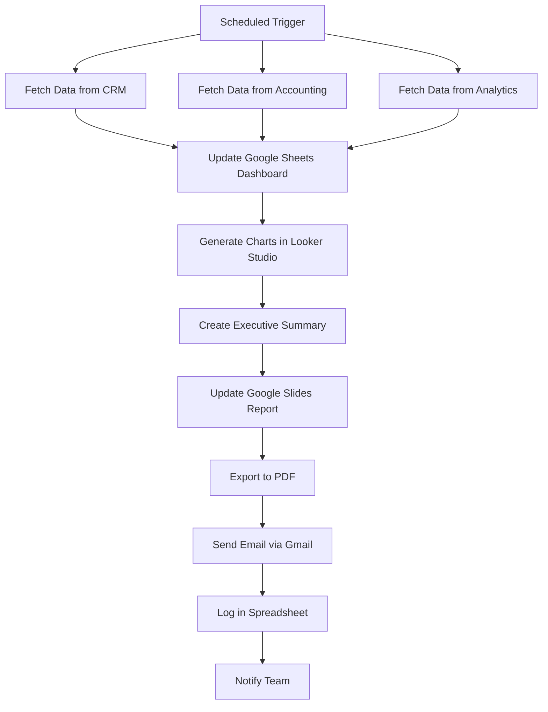

# SOP: Automated Business Report Generation
**Complete SOP for Weekly/Monthly Business Report Automation**

---

## 🎯 AUTOMATION OVERVIEW

**Automation Name:** Automated Business Performance Reports
**Purpose:** Automatically generate and distribute weekly/monthly business reports with key metrics and insights
**Impact:** Save 6+ hours per month, eliminate manual data gathering, ensure reports sent on schedule every time
**Owner:** Operations/Analytics Team
**Last Updated:** 2026-03-13

### Real-World Results
**Before Automation:**
- Time per month: 8 hours (gathering data from multiple sources, formatting, creating charts, emailing)
- Error rate: 20% (wrong data, formula mistakes, outdated information)
- Late reports: 2-3 per month (forgot, ran out of time, data not ready)
- Report quality: Inconsistent formatting, varying quality

**After Automation:**
- Time per month: 30 minutes (review and add insights)
- Error rate: 0% (automated calculations)
- Late reports: 0 (automated scheduling)
- Report quality: Consistent, professional, branded

**Annual ROI:** 90 hours saved × $65/hour = $5,850 in labor savings
**Additional Benefit:** Better business decisions from consistent, timely data

---

## 🛠️ PREREQUISITES & TOOLS

### Required Tools
- [ ] **Google Sheets** - Data aggregation and calculations
- [ ] **Google Looker Studio** (formerly Data Studio) - Data visualization
- [ ] **Zapier** or **Make** - Automation platform
- [ ] **Google Slides** - Report template (or PowerPoint)
- [ ] **Gmail** - Report distribution
- [ ] **Various Data Sources** - CRM, accounting software, analytics tools

### Access Requirements
- [ ] Google Workspace with Looker Studio access
- [ ] Zapier/Maker account
- [ ] API access to data sources (CRM, accounting, etc.)
- [ ] Email sending permissions

### Technical Skills Needed
- **Technical:** Intermediate (requires data understanding)
- **No-code/Low-code:** Zapier/Make basics + Looker Studio
- **Training needed:** 2-3 hours for Looker Studio basics

---

## 🔄 WORKFLOW DIAGRAM



---

## 📋 STEP-BY-STEP INSTRUCTIONS

### Phase 1: Setup (One-Time, 3 Hours)

#### Step 1.1: Define Report Metrics
**Time Required:** 30 minutes

**Instructions:**
1. Identify key metrics for your business:

**Revenue Metrics:**
- Total revenue (MRR/ARR for subscription, one-time for transactional)
- Revenue growth rate (%)
- Revenue by product/service
- Revenue by customer segment
- Average revenue per customer

**Sales Metrics:**
- New leads
- Conversion rate
- Sales cycle length
- Deal size (average)
- Pipeline value

**Marketing Metrics:**
- Website traffic
- Conversion rate
- Cost per lead
- Marketing ROI
- Channel performance

**Customer Metrics:**
- New customers
- Churn rate
- Customer satisfaction (NPS)
- Support tickets
- Customer lifetime value

**Operational Metrics:**
- Team productivity
- Project completion rate
- On-time delivery rate
- Budget variance

2. Prioritize metrics:
   - **Executive Summary (5 metrics)**: Top-level KPIs
   - **Department Details (10-15 metrics each)**: Deeper dive

3. Define data sources for each metric

**Verification:**
- [ ] List of all metrics defined
- [ ] Data sources identified
- [ ] Prioritization complete

---

#### Step 1.2: Set Up Data Aggregation in Google Sheets
**Time Required:** 45 minutes

**Instructions:**
1. Create new Google Sheet: "Business Report Data"
2. Create tabs:
   - **Executive Summary** - Top 5 KPIs
   - **Revenue** - All revenue metrics
   - **Sales** - All sales metrics
   - **Marketing** - All marketing metrics
   - **Customers** - All customer metrics
   - **Operations** - All operational metrics
   - **Calculations** - Intermediate calculations
   - **Log** - Report generation history

3. For each tab, create columns:
   - Metric Name
   - Current Period Value
   - Previous Period Value
   - Change ($)
   - Change (%)
   - Target
   - Variance from Target
   - Trend (Up/Down icon)

4. In **Calculations** tab, set up:
   - Period definitions (This Week, Last Week, This Month, Last Month, etc.)
   - Data source connections (using IMPORT functions or API pulls)
   - Calculation formulas

5. Example formulas:
   ```
   Current Month Revenue: =SUMIFS(RevenueData, DateRange, ">=ThisMonthStart")
   Previous Month Revenue: =SUMIFS(RevenueData, DateRange, ">=LastMonthStart")
   Change %: =IF(Previous>0, (Current-Previous)/Previous, 0)
   Variance: =Current-Target
   ```

**Verification:**
- [ ] All tabs created
- [ ] Data sources connected
- [ ] Formulas working correctly
- [ ] Test data populated

---

#### Step 1.3: Create Looker Studio Dashboard
**Time Required:** 1 hour

**Instructions:**
1. Go to lookerstudio.google.com
2. Create new report: "Business Performance Dashboard"
3. Connect data source: Google Sheets (from Step 1.2)
4. Create pages:

**Page 1: Executive Summary**
- Score cards: Top 5 KPIs with current values and trends
- Summary chart: Revenue over time
- Highlights table: Best/worst performers

**Page 2: Revenue**
- Line chart: Revenue trend (monthly/weekly)
- Bar chart: Revenue by product/service
- Pie chart: Revenue by customer segment
- Table: Top 10 customers by revenue

**Page 3: Sales**
- Funnel chart: Lead to customer conversion
- Bar chart: Sales by team member
- Line chart: Pipeline value over time
- Table: Open deals by stage

**Page 4: Marketing**
- Line chart: Website traffic
- Bar chart: Leads by channel
- Table: Campaign performance
- Score card: Cost per lead

**Page 5: Customers**
- Line chart: Customer growth
- Bar chart: Churn by segment
- Gauge: NPS score
- Table: At-risk customers

5. Apply branding:
   - Add company logo
   - Use brand colors
   - Choose professional fonts
   - Add filters (date range, department, etc.)

6. Set up automatic data refresh:
   - Settings → Data Source → Refresh: Every hour

**Verification:**
- [ ] All pages created
- [ ] Charts display correctly
- [ ] Branding applied
- [ ] Data refresh configured
- [ ] Filters working

---

#### Step 1.4: Create Report Template in Google Slides
**Time Required:** 30 minutes

**Instructions:**
1. Create new Google Slides: "Business Report Template"
2. Create slides:

**Slide 1: Title Slide**
- Report Title: [Company Name] Business Report
- Period: {{report_period}}
- Date: {{report_date}}
- Prepared by: {{prepared_by}}
- Company logo

**Slide 2: Executive Summary**
- Top 5 KPIs (from Looker Studio screenshots or embedded)
- Key highlights (bullet points with placeholders)
- Key concerns (bullet points)
- Overall status: {{status}} (On Track/At Risk/Needs Attention)

**Slide 3: Revenue Performance**
- Revenue chart (embed from Looker Studio)
- Key metrics table
- Analysis/insights (text placeholders)

**Slide 4: Sales Pipeline**
- Sales metrics (embed from Looker Studio)
- Pipeline visualization
- Opportunities table

**Slide 5: Marketing Performance**
- Marketing metrics (embed from Looker Studio)
- Channel performance
- Campaign highlights

**Slide 6: Customer Insights**
- Customer metrics (embed from Looker Studio)
- NPS/Satisfaction
- At-risk customers

**Slide 7: Operational Metrics**
- Team productivity
- Project status
- Budget vs actual

**Slide 8: Key Insights & Actions**
- Top 3 insights (bulleted)
- Required actions (bulleted with owners)
- Decisions needed (bulleted)

**Slide 9: Next Period Focus**
- Goals for next period
- Key initiatives
- Resources needed

**Slide 10: Questions/Feedback**
- Contact information
- Link to full dashboard
- Request for feedback

3. Add placeholder variables:
   - `{{report_period}}` - "Week of X" or "Month of X"
   - `{{report_date}}` - Date generated
   - `{{prepared_by}}` - Report owner
   - `{{status}}` - Overall status
   - Other text placeholders for insights

4. Apply professional formatting:
   - Consistent fonts and colors
   - Company branding
   - Clean layout
   - Professional charts

**Verification:**
- [ ] All 10 slides created
- [ ] Placeholders marked with {{braces}}
- [ ] Formatting professional
- [ ] Branding applied
- [ ] Layout clean

---

#### Step 1.5: Set Up Zapier Account
**Time Required:** 15 minutes

**Instructions:**
1. Sign up at zapier.com
2. Connect Google Sheets
3. Connect Google Slides
4. Connect Gmail
5. Test all connections

**Verification:**
- [ ] All connections successful
- [ ] Can access Sheets/Slides
- [ ] Can send emails

---

### Phase 2: Build Automation (2 Hours)

#### Step 2.1: Create Trigger - Schedule
**Time Required:** 5 minutes

**Instructions:**
1. Create new Zap
2. Trigger: **Schedule by Zapier**
3. Configure:
   - Weekly: Every Monday at 9:00 AM
   - Monthly: 1st of month at 9:00 AM
   - Timezone: Your timezone

**Settings:**
| Setting | Value | Notes |
|---------|-------|-------|
| Frequency | Weekly/Monthly | Choose based on report |
| Day | Monday/1st | Adjust as needed |
| Time | 9:00 AM | Business hours |

**Verification:**
- [ ] Trigger set correctly
- [ ] Timezone matches
- [ ] Test trigger fires

---

#### Step 2.2: Fetch Data from Sources
**Time Required:** 20 minutes

**Instructions:**
1. **For Google Sheets data sources:**
   - Add action: **Google Sheets → Get Rows**
   - Fetch latest data from each source
   - Update "Business Report Data" sheet

2. **For API-based sources (CRM, Analytics, etc.):**
   - Add action: **Webhooks → GET**
   - Configure API endpoints
   - Parse JSON responses
   - Map to Google Sheets columns

3. **For manual data sources:**
   - Create structured input forms
   - Send reminder emails to input data
   - Provide deadline (e.g., "Due by Friday 5 PM")

**Settings:**
| Source | Method | Update Frequency |
|--------|--------|------------------|
| Google Sheets | Get Rows | Every report |
| CRM (API) | Webhook GET | Every report |
| Analytics (API) | Webhook GET | Every report |
| Manual | Email reminder | Weekly/monthly |

**Verification:**
- [ ] All data sources connected
- [ ] Data fetches correctly
- [ ] Google Sheets updates

---

#### Step 2.3: Update Dashboard and Generate Charts
**Time Required:** 10 minutes

**Instructions:**
1. Looker Studio auto-refreshes every hour
2. No Zapier action needed
3. Verify data refreshed:
   - Check timestamp on dashboard
   - Verify metrics updated

**Verification:**
- [ ] Dashboard data current
- [ ] Charts updated
- [ ] All metrics populate

---

#### Step 2.4: Generate Executive Summary
**Time Required:** 20 minutes

**Instructions:**
1. Add action: **Code by Zapier → Run Python**
2. Use this logic:

```python
# Generate executive summary insights
data = {
  'revenue': input_data['revenue'],
  'revenue_change': input_data['revenue_change'],
  'leads': input_data['leads'],
  'conversion_rate': input_data['conversion_rate'],
  'nps': input_data['nps']
}

# Determine status
if data['revenue_change'] > 10 and data['nps'] > 8:
  status = "On Track 🟢"
elif data['revenue_change'] > 0 and data['nps'] > 6:
  status = "At Risk 🟡"
else:
  status = "Needs Attention 🔴"

# Generate highlights
highlights = []
if data['revenue_change'] > 0:
  highlights.append(f"Revenue up {data['revenue_change']}%")
if data['leads'] > 100:
  highlights.append(f"Strong lead generation: {data['leads']} leads")
if data['conversion_rate'] > 0.05:
  highlights.append(f"Conversion rate strong at {data['conversion_rate']*100}%")

# Generate concerns
concerns = []
if data['revenue_change'] < 0:
  concerns.append(f"Revenue down {abs(data['revenue_change'])}%")
if data['nps'] < 7:
  concerns.append(f"NPS below target: {data['nps']}")
if data['conversion_rate'] < 0.03:
  concerns.append("Conversion rate needs improvement")

return {
  'status': status,
  'highlights': '\n'.join(highlights),
  'concerns': '\n'.join(concerns)
}
```

**Verification:**
- [ ] Code runs without errors
- [ ] Insights generated correctly
- [ ] Status logic works

---

#### Step 2.5: Update Google Slides Report
**Time Required:** 20 minutes

**Instructions:**
1. Add action: **Google Slides → Create Presentation from Template**
2. Configure:
   - Template: "Business Report Template"
   - New Name: `[Company Name] Report - {{report_period}}`
   - Replace placeholders:
     - `{{report_period}}` → From trigger
     - `{{report_date}}` → Today's date
     - `{{prepared_by}}` → Report owner
     - `{{status}}` → From Code step

3. Add action: **Google Slides → Replace Text/Image**
4. For each slide, embed Looker Studio charts:
   - Add image from URL (Looker Studio chart export)
   - Or paste screenshots manually (not automatable)

**Note:** Full Google Slides automation via Zapier is limited. Consider:
- Using Google Slides API with custom code
- Or exporting Looker Dashboard to PDF and attaching to email
- Or keeping reports in Looker Studio (no Slides needed)

**Verification:**
- [ ] Slides created from template
- [ ] Placeholders replaced
- [ ] Charts included (manual or auto)

---

#### Step 2.6: Export to PDF (Alternative)
**Time Required:** 15 minutes

**Instructions:**
1. Skip Google Slides if full automation needed
2. Use Looker Studio export:
   - Add action: **Google Drive → Upload File**
   - Export Looker Dashboard to PDF
   - Save to "Reports" folder

3. Or create PDF from Google Sheets:
   - Add action: **Google Drive → Export Sheet to PDF**
   - Include all metric tabs
   - Apply formatting

**Verification:**
- [ ] PDF generates correctly
- [ ] All charts included
- [ ] Formatting looks good

---

#### Step 2.7: Send Report via Email
**Time Required:** 10 minutes

**Instructions:**
1. Add action: **Gmail → Send Email**
2. Configure:
   - To: Distribution list (executive team, department heads)
   - Subject: `[Company Name] Business Report - {{report_period}}`
   - Body:
     ```
     Hi Team,

     Please find attached the business report for {{report_period}}.

     **Executive Summary:**
     Status: {{status}}

     **Key Highlights:**
     {{highlights}}

     **Areas of Concern:**
     {{concerns}}

     **Full Report:** [View Dashboard]({{dashboard_link}})
     [Download PDF]({{pdf_link}})

     **Next Steps:**
     - Review full dashboard: {{dashboard_link}}
     - Submit questions/feedback: [Feedback Form]
     - Next report: {{next_report_date}}

     Best regards,
     {{prepared_by}}
     ```

   - Attach PDF (if generated)

**Settings:**
| Setting | Value | Notes |
|---------|-------|-------|
| To | Distribution list | Executive team |
| Subject | Clear and descriptive | Include period |
| Body | Executive summary | Key takeaways |
| Attachment | PDF | If generated |

**Verification:**
- [ ] Email sends successfully
- [ ] All variables filled
- [ ] Links work
- [ ] PDF attached (if applicable)

---

#### Step 2.8: Log Report Generation
**Time Required:** 5 minutes

**Instructions:**
1. Add action: **Google Sheets → Create Row**
2. Configure:
   - Tab: "Log"
   - Row:
     - Report Date: {{today}}
     - Report Period: {{report_period}}
     - Status: {{status}}
     - Recipients: Distribution list
     - PDF Link: {{pdf_link}}
     - Sent By: {{prepared_by}}

**Verification:**
- [ ] Row created in log
- [ ] All fields populated
- [ ] Links work

---

#### Step 2.9: Add Error Handling
**Time Required:** 10 minutes

**Instructions:**
1. Add error handlers to key steps
2. Configure:
   - If data fetch fails: Notify data team, use last period's data
   - If PDF generation fails: Send dashboard link instead
   - If email fails: Retry in 1 hour, notify admin

3. Set up error notifications:
   - Slack message to analytics team
   - Email to report owner

**Verification:**
- [ ] Error handlers in place
- [ ] Notifications configured
- [ ] Fallback options working

---

### Phase 3: Testing (1 Hour)

#### Step 3.1: Test Complete Flow
**Time Required:** 30 minutes

**Instructions:**
1. Manually trigger automation
2. Watch each step execute
3. Verify:
   - Data fetches correctly
   - Dashboard updates
   - Insights generated
   - Report created
   - Email sends with attachments

**Success Criteria:**
- [ ] All steps execute
- [ ] Data accurate
- [ ] Report looks professional
- [ ] Email received

---

#### Step 3.2: Test Edge Cases
**Time Required:** 30 minutes

**Test Case 1: Missing Data**
- Remove one data source
- Expected: Report generates with note about missing data
- Actual: ___

**Test Case 2: Negative Metrics**
- Set revenue to negative growth
- Expected: Status = "Needs Attention"
- Actual: ___

**Success Criteria:**
- [ ] Edge cases handled
- [ ] Graceful failures
- [ ] Clear error messages

---

## 🧪 TESTING PROTOCOL

| Test Scenario | Expected Result | Status |
|--------------|----------------|--------|
| Normal report generation | Complete report with all data | Pass/Fail |
| Missing data source | Report generates with notes | Pass/Fail |
| Negative metrics | Status reflects concerns | Pass/Fail |
| Email delivery | All recipients receive | Pass/Fail |

---

## 📈 MONITORING & MAINTENANCE

### Weekly (15 minutes)
- [ ] Check report sent successfully
- [ ] Review data accuracy
- [ ] Gather feedback

### Monthly (30 minutes)
- [ ] Review all reports
- [ ] Update metrics if needed
- [ ] Optimize dashboard
- [ ] Update SOP

---

## 🚨 TROUBLESHOOTING

### Issue #1: Data Not Updating
**Solution:** Check data source connections, verify API tokens, refresh Looker Studio

### Issue #2: Wrong Calculations
**Solution:** Review formulas in Sheets, verify data types

### Issue #3: Email Not Received
**Solution:** Check distribution list, verify spam folder

---

## 🔙 ROLLBACK PROCEDURES

**Manual Process (2 hours):**
1. Export data manually from sources
2. Update Google Sheets
3. Refresh Looker Studio
4. Export to PDF
5. Email manually

---

## 👥 TEAM HANDOFF

**Training (2 hours):**
- [ ] How to update data sources
- [ ] How to customize dashboard
- [ ] How to interpret metrics
- [ ] How to handle errors

**Quick Reference:**
- Check dashboard: Looker Studio link
- Manual trigger: Zapier dashboard
- Data issues: Check Sheets formulas

---

## 📊 SUCCESS METRICS

| Metric | Before | After | Target | Current |
|--------|--------|-------|--------|---------|
| Time/month | 8 hrs | 30 min | <1 hr | 30 min ✅ |
| Error rate | 20% | 0% | <5% | 0% ✅ |
| Late reports | 2-3 | 0 | 0 | 0 ✅ |

**ROI:** 90 hours × $65 = $5,850/year

---

## 🎯 NEXT STEPS

**Immediate:** Deploy weekly reports
**Short-term:** Add predictive analytics
**Long-term:** Build custom analytics platform

---

**SOP Version:** 1.0
**Last Updated:** 2026-03-13

---

## 💡 PRO TIPS

### Report Best Practices
- **Keep it simple:** Focus on key metrics, don't overwhelm
- **Visualize data:** Charts > Tables
- **Provide context:** Explain what metrics mean
- **Include insights:** Not just data, but what it means
- **Action-oriented:** What should we do about this data?

### Common Mistakes
- ❌ Don't include too many metrics
- ❌ Don't ignore data quality issues
- ❌ Don't forget to explain anomalies

---

**Remember:** Systems before willpower. Automate the data gathering, keep the human analysis and decision-making.
