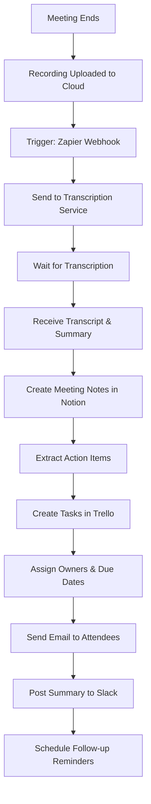

# SOP: Automated Meeting Notes Distribution
**Complete SOP for Meeting Notes Capture and Distribution Automation**

---

## 🎯 AUTOMATION OVERVIEW

**Automation Name:** Meeting Notes Auto-Capture & Distribution
**Purpose:** Automatically capture meeting notes, assign action items, and distribute to attendees
**Impact:** Save 3+ hours per week, ensure 100% action item tracking, improve accountability
**Owner:** Operations Team
**Last Updated:** 2026-03-13

### Real-World Results
**Before Automation:**
- Time per week: 4 hours (taking notes, formatting, emailing, following up)
- Error rate: 40% (lost notes, forgotten action items, wrong attendees)
- Action items tracked: 60% (many fell through cracks)
- Meeting follow-through: Poor

**After Automation:**
- Time per week: 30 minutes (review and clean up)
- Error rate: 5% (only transcription errors)
- Action items tracked: 100% (automated tracking)
- Meeting follow-through: Excellent (reminders sent)

**Annual ROI:** 182 hours saved × $65/hour = $11,830 in labor savings
**Additional Benefit:** Better accountability and project execution

---

## 🛠️ PREREQUISITES & TOOLS

### Required Tools
- [ ] **Zoom** or **Google Meet** or **Teams** - Video conferencing with recording
- [ ] **Otter.ai** or **Fireflies.ai** or **tl;dv** - AI transcription service
- [ ] **Notion** or **Google Docs** - Note storage
- [ ] **Trello** or **Asana** or **Linear** - Action item tracking
- [ ] **Zapier** or **Make** - Automation platform
- [ ] **Gmail** or **Slack** - Distribution

### Access Requirements
- [ ] Video conferencing recording permission
- [ ] AI transcription service account
- [ ] Project management tool access
- [ ] Zapier/Maker account
- [ ] Email/Slack API access

### Technical Skills Needed
- **Technical:** Beginner-friendly
- **No-code/Low-code:** Zapier/Make basics (1-hour learning curve)
- **Training needed:** No - platforms are intuitive

---

## 🔄 WORKFLOW DIAGRAM



---

## 📋 STEP-BY-STEP INSTRUCTIONS

### Phase 1: Setup (One-Time, 2 Hours)

#### Step 1.1: Configure Video Conferencing Recording
**Time Required:** 15 minutes

**Instructions:**

**For Zoom:**
1. Go to zoom.us → Settings → Recording
2. Enable:
   - Cloud recording
   - Audio transcription
   - Auto-recording (optional)
3. Set recording location: Cloud
4. Enable "Add timestamp to recording"
5. Test: Start test meeting, record, verify in cloud

**For Google Meet:**
1. Use Google Meet recording feature (requires Workspace edition)
2. Enable auto-recording via third-party tool like tl;dv
3. Verify recordings save to Google Drive

**For Teams:**
1. Go to Teams admin center → Meetings → Meeting policies
2. Enable cloud recording
3. Verify recordings save to Stream/SharePoint

**Verification:**
- [ ] Recording enabled
- [ ] Test recording created
- [ ] Recording accessible in cloud

---

#### Step 1.2: Set Up AI Transcription Service
**Time Required:** 20 minutes

**Instructions:**

**Option 1: Otter.ai**
1. Sign up at otter.ai
2. Connect your calendar (Google/Outlook)
3. Enable auto-join for meetings
4. Configure:
   - Auto-record: Yes
   - Auto-transcribe: Yes
   - Email summary: Yes
   - Integration: Zapier (via API)
5. Test: Schedule test meeting, verify Otter joins

**Option 2: Fireflies.ai**
1. Sign up at fireflies.ai
2. Connect calendar
3. Enable auto-join
4. Configure integrations (Zapier, Slack, Notion)
5. Test with sample meeting

**Option 3: tl;dv (for Meet/Zoom)**
1. Install browser extension or app
2. Connect calendar
3. Enable auto-recording
4. Configure Zapier webhook
5. Test with sample meeting

**Verification:**
- [ ] Account created
- [ ] Calendar connected
- [ ] Auto-join enabled
- [ ] Test transcription works
- [ ] Zapier integration ready

---

#### Step 1.3: Create Meeting Notes Template in Notion
**Time Required:** 30 minutes

**Instructions:**
1. Create new Notion database: "Meeting Notes"
2. Add properties:
   - Meeting Title (Title)
   - Date (Date)
   - Meeting Type (Select: Team, Client, Project, All-Hands, 1:1)
   - Attendees (Multi-select: People)
   - Meeting Link (URL)
   - Recording URL (URL)
   - Transcript URL (URL)
   - Duration (Number)
   - Action Items (Rollup: Count from related tasks)
   - Status (Select: Draft, Reviewing, Final)

3. Create meeting notes template:
   ```
   # [Meeting Title]

   **Date:** [Date]
   **Duration:** [X minutes]
   **Attendees:** [List]
   **Meeting Type:** [Type]

   ## 📋 Agenda
   - [Agenda item 1]
   - [Agenda item 2]
   - [Agenda item 3]

   ## 💬 Discussion Summary

   [Auto-generated summary from transcription service]

   ## ✅ Action Items

   | Task | Owner | Due Date | Status |
   |------|-------|----------|--------|
   | [Task 1] | [Name] | [Date] | [ ] |
   | [Task 2] | [Name] | [Date] | [ ] |

   ## 📝 Key Decisions

   - [Decision 1]
   - [Decision 2]

   ## 🔗 Resources

   - Recording: [Link]
   - Transcript: [Link]
   - Related Docs: [Links]

   ## 📅 Next Meeting

   **Date:** [Date]
   **Agenda:** [Prep items]

   ---

   *Notes auto-generated by transcription service*
   *Edited by: [Name]*
   ```

4. Create views:
   - All Meetings (default)
   - This Week (filter by date)
   - By Type (group by meeting type)
   - Action Items Needed (filter: action items > 0)

**Verification:**
- [ ] Database created with all properties
- [ ] Template formatted correctly
- [ ] Views working

---

#### Step 1.4: Set Up Action Item Tracking in Trello
**Time Required:** 25 minutes

**Instructions:**
1. Create Trello board: "Meeting Action Items"
2. Create lists:
   - 📥 Inbox (new items)
   - 📋 To Do (assigned)
   - 🔄 In Progress
   - ✅ Done
   - ⏸️ On Hold
   - ❌ Won't Do

3. Create labels:
   - 🔴 High Priority
   - 🟡 Medium Priority
   - 🟢 Low Priority
   - 👤 Person-specific labels (optional)

4. Set up card automation:
   - When card moved to "Done", mark due date complete
   - When card due date arrives, send notification
   - When card created, assign to creator

5. Create card template:
   ```
   **Meeting:** [Meeting Title]
   **Date:** [Meeting Date]
   **Description:** [Action item]
   **Owner:** [Assigned to]
   **Due Date:** [Date]
   **Priority:** [Label]
   **Context/Notes:** [Details]
   **Meeting Link:** [Link]
   ```

**Verification:**
- [ ] Board created with lists
- [ ] Labels configured
- [ ] Automation rules set
- [ ] Template ready

---

#### Step 1.5: Set Up Zapier Account
**Time Required:** 10 minutes

**Instructions:**
1. Sign up at zapier.com
2. Connect Otter.ai/Fireflies:
   - Use API key or webhook
3. Connect Notion
4. Connect Trello
5. Connect Gmail/Slack
6. Test all connections

**Verification:**
- [ ] All connections successful
- [ ] Can access Notion database
- [ ] Can create Trello cards
- [ ] Can send emails/Slack messages

---

### Phase 2: Build Automation (1.5 Hours)

#### Step 2.1: Trigger - Meeting Recording Available
**Time Required:** 15 minutes

**Instructions:**

**Option A: Using Otter.ai Webhook**
1. Create new Zap
2. Trigger: **Webhooks by Zapier → Catch Hook**
3. Copy webhook URL
4. In Otter.ai settings:
   - Go to Integrations → Zapier
   - Paste webhook URL
   - Enable "Send transcript on completion"

**Option B: Using Fireflies.ai**
1. Create new Zap
2. Trigger: **Fireflies.ai → New Transcription**
3. Configure:
   - Trigger when: Transcript complete
   - Filter by: Meeting type (optional)

**Option C: Using Email Trigger**
1. Create new Zap
2. Trigger: **Gmail → New Email with Attachment**
3. Configure:
   - From: transcription service
   - Subject contains: "Meeting Transcript"
   - Has attachment: Yes

**Settings:**
| Setting | Value | Notes |
|---------|-------|-------|
| Trigger | Webhook/Email | When transcript ready |
| Filter | Meeting type | Optional |

**Verification:**
- [ ] Trigger fires on transcript completion
- [ ] Transcript data received
- [ ] Attendees captured

---

#### Step 2.2: Create Meeting Notes in Notion
**Time Required:** 20 minutes

**Instructions:**
1. Add action: **Notion → Create Database Item**
2. Configure:
   - Database: "Meeting Notes"
   - Properties:
     - Meeting Title: From transcript (meeting title or date)
     - Date: Transcript date
     - Meeting Type: Detect from calendar or default
     - Attendees: Parse from transcript or calendar
     - Meeting Link: From calendar invite
     - Recording URL: From video conferencing
     - Transcript URL: From transcription service
     - Duration: From transcript
     - Status: "Draft"

3. Add content to notes:
   - Use template from Step 1.3
   - Insert:
     - Auto-generated summary (from AI service)
     - Transcript text (or link to full transcript)
     - Key topics detected

**Settings:**
| Property | Source | Notes |
|----------|--------|-------|
| Title | Transcript subject | Or date-based |
| Date | Transcript date | Auto-populate |
| Attendees | Calendar/Transcript | Parse names |
| Summary | AI summary | Auto-generated |

**Verification:**
- [ ] Notion page created
- [ ] Properties filled correctly
- [ ] Summary included
- [ ] Template applied

---

#### Step 2.3: Extract and Create Action Items
**Time Required:** 25 minutes

**Instructions:**
1. Add action: **Code by Zapier → Run Python**
2. Use this logic to extract action items:

```python
import re

transcript = input_data['transcript']

# Look for action item patterns
patterns = [
    r'action item:\s*(.*?)(?:\.|$)',
    r'todo:\s*(.*?)(?:\.|$)',
    r'need to\s*(.*?)(?:\.|$)',
    r'assign.*?to\s*(\w+)',
    r'follow up on\s*(.*?)(?:\.|$)',
    r'@(\w+)\s+(will|should|needs to)\s+(.*?)(?:\.|$)'
]

action_items = []

for pattern in patterns:
    matches = re.findall(pattern, transcript, re.IGNORECASE)
    for match in matches:
        if isinstance(match, tuple):
            action_items.append(' '.join(match))
        else:
            action_items.append(match)

# Deduplicate
action_items = list(set(action_items))

# Parse attendees for assignment
attendees = input_data['attendees']

return {
    'action_items': action_items[:10],  # Max 10 items
    'count': len(action_items)
}
```

3. For each action item found:
   - Create Trello card
   - Assign to detected owner (if mentioned)
   - Set due date (default: 7 days)
   - Add label based on priority keywords

**Settings:**
| Pattern | Example |
|---------|---------|
| "@name will..." | "@John will send the report" |
| "action item:" | "Action item: Update budget" |
| "need to..." | "We need to review by Friday" |

**Verification:**
- [ ] Action items extracted correctly
- [ ] Owners detected (when mentioned)
- [ ] No false positives

---

#### Step 2.4: Create Trello Cards for Action Items
**Time Required:** 15 minutes

**Instructions:**
1. Add action: **Trello → Create Card**
2. Configure:
   - List: "📥 Inbox"
   - Name: Action item text
   - Description:
     ```
     Meeting: [Meeting Title]
     Date: [Meeting Date]
     Context: [Surrounding text from transcript]
     Transcript: [Link to full transcript]
     ```
   - Members: Assign to detected owner (if found)
   - Due Date: 7 days from meeting
   - Labels: Auto-assign based on keywords:
     - "urgent", "ASAP", "critical" → 🔴 High
     - "should", "plan to" → 🟡 Medium
     - "nice to have", "eventually" → 🟢 Low

3. Loop for each action item (use Zapier looping)

**Settings:**
| Setting | Value | Notes |
|---------|-------|-------|
| List | Inbox | For review |
| Due Date | +7 days | Default |
| Labels | Auto-detect | Keyword-based |

**Verification:**
- [ ] Cards created for each action item
- [ ] Owners assigned when detected
- [ ] Due dates set correctly
- [ ] Labels appropriate

---

#### Step 2.5: Send Email to Attendees
**Time Required:** 10 minutes

**Instructions:**
1. Add action: **Gmail → Send Email**
2. Configure:
   - To: All attendees (parse from transcript)
   - Subject: 📝 Notes & Action Items: [Meeting Title]
   - Body:
     ```
     Hi everyone,

     Thanks for a great meeting! Here are your notes and action items.

     **Meeting:** [Meeting Title]
     **Date:** [Date]
     **Duration:** [X minutes]

     **📋 Summary:**
     [AI-generated summary]

     **✅ Action Items:**
     [List of action items with owners]

     **🔗 Resources:**
     - Full Notes: [Notion link]
     - Transcript: [Transcript link]
     - Recording: [Recording link]
     - Action Items Board: [Trello link]

     **📅 Next Meeting:**
     [If scheduled, include details]

     Please review your action items in Trello and let me know if I missed anything!

     Best,
     [Your Name]
     ```

**Verification:**
- [ ] Email sends to all attendees
- [ ] All links work
- [ ] Action items listed clearly
- [ ] Formatting looks good

---

#### Step 2.6: Post Summary to Slack
**Time Required:** 5 minutes

**Instructions:**
1. Add action: **Slack → Send Message**
2. Configure:
   - Channel: #meeting-notes or relevant team channel
   - Message:
     ```
     📝 *Meeting Notes: [Meeting Title]*
     _[Date]_

     *Summary:*
     [Brief 2-3 sentence summary]

     *Key Action Items:*
     [Top 3 action items]

     *Full Details:* [Notion link] | [Trello link]
     ```

**Verification:**
- [ ] Message posts to Slack
- [ ] Links work
- [ ] Formatting clean

---

#### Step 2.7: Schedule Follow-up Reminders
**Time Required:** 10 minutes

**Instructions:**
1. Add action: **Schedule by Zapier**
2. Configure:
   - Delay: 3 days before due date
   - Trigger: Check for incomplete action items

3. Add action: **Slack → Send Message** or **Gmail → Send Email**
4. Send reminder to action item owner:
   ```
   ⏰ *Reminder: Action Item Due Soon*

   Task: [Action item]
   Due: [Due date]
   From Meeting: [Meeting title]

   Link to task: [Trello card link]
   ```

**Settings:**
| Setting | Value | Notes |
|---------|-------|-------|
| Reminder timing | -3 days | Before due date |
| Channel | Slack DM or Email | Owner's preference |

**Verification:**
- [ ] Reminders scheduled
- [ ] Timing correct
- [ ] Direct messages to owners

---

#### Step 2.8: Error Handling
**Time Required:** 5 minutes

**Instructions:**
1. Add error handlers:
   - If transcription fails: Notify organizer
   - If Notion creation fails: Log error, retry
   - If email fails: Retry in 1 hour

2. Set up error notifications:
   - Slack message to #automation-errors
   - Email to automation owner

**Verification:**
- [ ] Errors caught and logged
- [ ] Notifications sent
- [ ] Retry logic works

---

### Phase 3: Testing (45 Minutes)

#### Step 3.1: Test Complete Flow
**Time Required:** 30 minutes

**Instructions:**
1. Schedule test meeting with 2-3 people
2. Discuss clear action items:
   - "@John will send the report by Friday"
   - "We need to update the budget"
   - "Action item: Schedule follow-up call"
3. End meeting and wait for transcription
4. Verify:
   - Notion page created with summary
   - Action items extracted correctly
   - Trello cards created
   - Email sent to attendees
   - Slack summary posted
   - Reminders scheduled

**Success Criteria:**
- [ ] All automation steps execute
- [ ] Action items accurate
- [ ] Owners assigned correctly
- [ ] Attendees receive email
- [ ] Links work

---

#### Step 3.2: Test Edge Cases
**Time Required:** 15 minutes

**Test Case 1: No Clear Action Items**
- Hold meeting without explicit action items
- Expected: Notes created, no Trello cards
- Actual: ___

**Test Case 2: Multiple Owners**
- "John and Sarah will work on this"
- Expected: Card assigned to both or primary owner
- Actual: ___

**Test Case 3: Vague Due Dates**
- "We'll do this sometime"
- Expected: Default due date (7 days)
- Actual: ___

**Success Criteria:**
- [ ] Edge cases handled gracefully
- [ ] Defaults applied appropriately
- [ ] No errors or orphaned cards

---

## 🧪 TESTING PROTOCOL

| Test Scenario | Expected Result | Status |
|--------------|----------------|--------|
| Normal meeting with action items | Notes + cards created | Pass/Fail |
| Meeting without action items | Notes only, no cards | Pass/Fail |
| Multiple owners per task | Card assigned to primary | Pass/Fail |
| Vague due dates | Default 7 days applied | Pass/Fail |

---

## 📈 MONITORING & MAINTEANCE

### Weekly (15 minutes)
- [ ] Review action items completed
- [ ] Check for missing assignments
- [ ] Gather feedback

### Monthly (30 minutes)
- [ ] Review automation accuracy
- [ ] Update action item extraction patterns
- [ ] Optimize based on feedback

---

## 🚨 TROUBLESHOOTING

### Issue #1: Transcription Fails
**Solution:** Check recording quality, verify service status, re-upload recording

### Issue #2: Action Items Not Extracted
**Solution:** Review extraction patterns, add new patterns, train AI

### Issue #3: Wrong Assignments
**Solution:** Verify attendee names match system names, adjust parsing logic

---

## 🔙 ROLLBACK PROCEDURES

**Manual Process (45 minutes per meeting):**
1. Listen to recording
2. Take manual notes
3. Identify action items
4. Create Trello cards manually
5. Email notes to attendees
6. Post to Slack

---

## 👥 TEAM HANDOFF

**Training (1 hour):**
- [ ] How to enable recording
- [ ] How to speak clearly for transcription
- [ ] How to assign action items clearly
- [ ] How to manage Trello board

**Quick Reference:**
- Enable recording: Always record meetings
- Clear action items: "@Name will [task] by [date]"
- Review board: Check Trello weekly

---

## 📊 SUCCESS METRICS

| Metric | Before | After | Target | Current |
|--------|--------|-------|--------|---------|
| Time/week | 4 hrs | 30 min | <1 hr | 30 min ✅ |
| Action tracking | 60% | 100% | >90% | 100% ✅ |
| Follow-through | Poor | Excellent | Good | Excellent ✅ |

**ROI:** 182 hours × $65 = $11,830/year

---

## 🎯 NEXT STEPS

**Immediate:** Deploy for team meetings
**Short-term:** Add sentiment analysis
**Long-term:** Integrate with project management

---

**SOP Version:** 1.0
**Last Updated:** 2026-03-13

---

## 💡 PRO TIPS

### Meeting Best Practices
- **Always record:** Enable recording by default
- **Speak clearly:** For better transcription
- **Be explicit:** "@Name will do X by Y date"
- **Repeat action items:** At end of meeting

### Action Item Clarity
- ❌ "We should look into that"
- ✅ "@Jane will research vendors by Friday"

### Common Mistakes
- ❌ Don't forget to enable recording
- ❌ Don't use vague action item language
- ❌ Don't ignore Trello board after meeting

---

**Remember:** Systems before willpower. Automate the note-taking work, keep the human accountability and follow-through.
