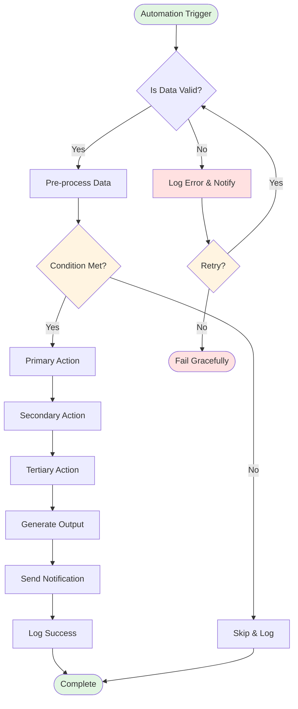
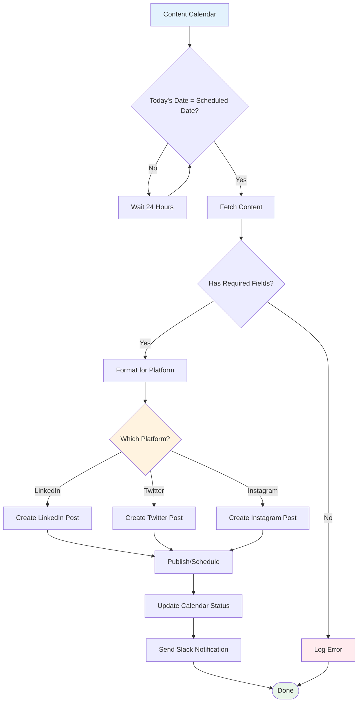
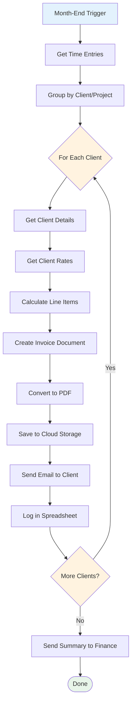
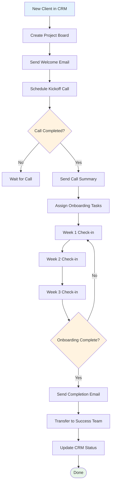
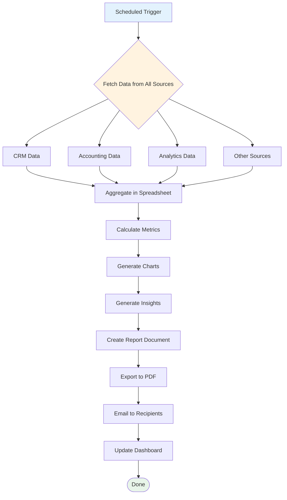
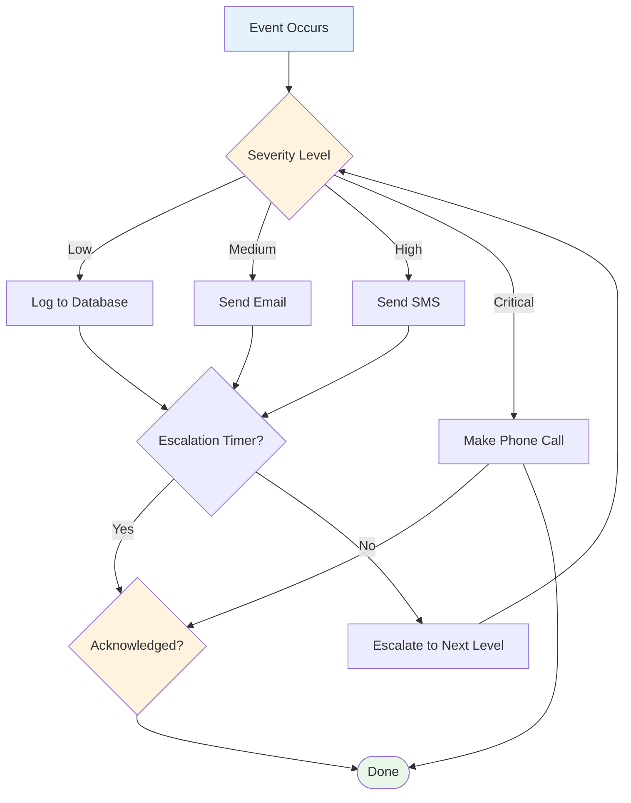
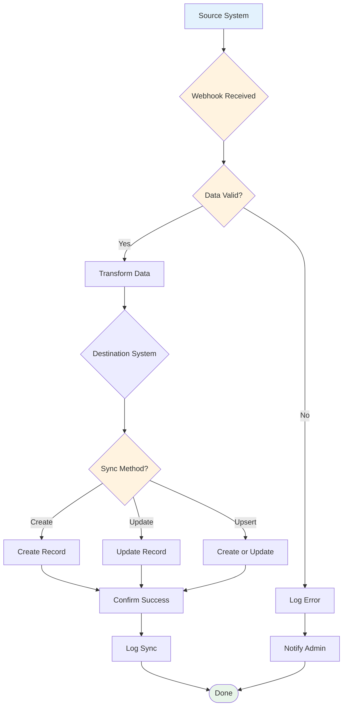
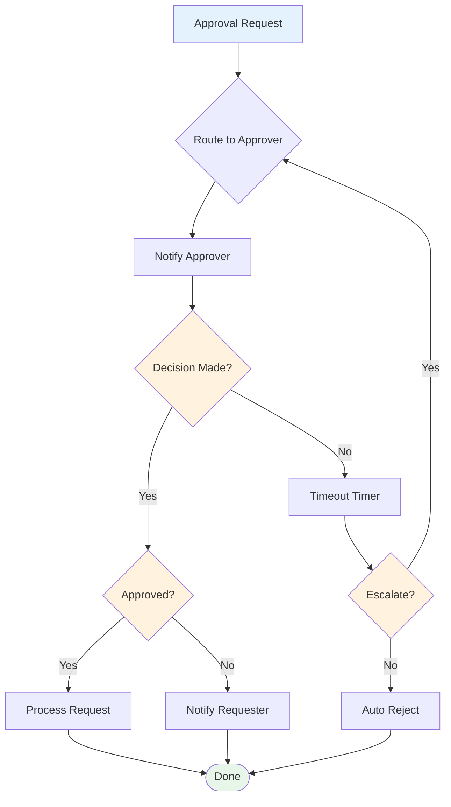
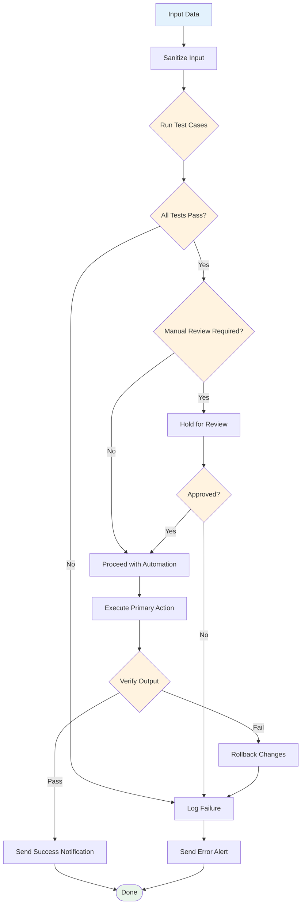
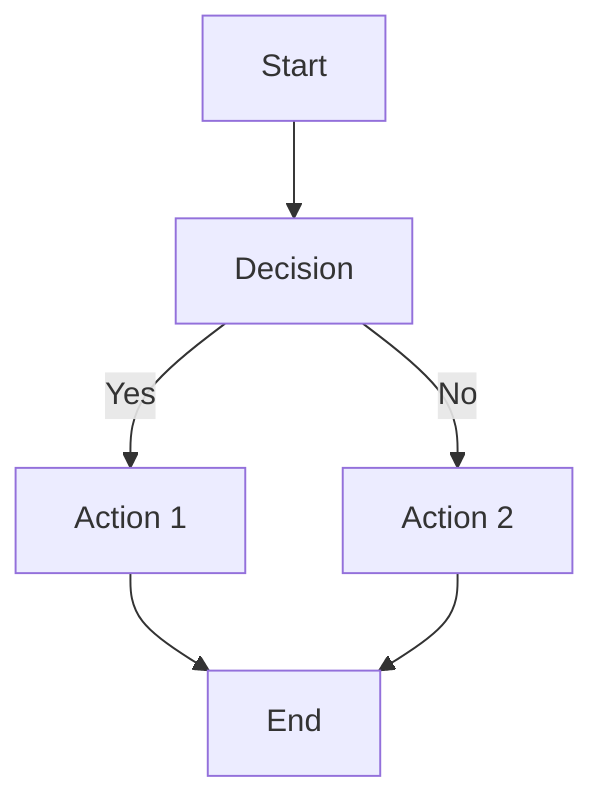

# Automation Workflow Diagrams
**Visual Workflow Templates for Common Business Automations**

---

## 🎯 HOW TO USE THESE DIAGRAMS

These workflow diagrams serve as visual blueprints for building automations. Each diagram shows:
- **Triggers** (what starts the automation)
- **Decisions** (conditional logic)
- **Actions** (what the automation does)
- **Outputs** (the result)
- **Error handling** (what to do when things go wrong)

**Before building any automation:**
1. Review the relevant diagram
2. Map it to your specific tools
3. Identify where data comes from and goes
4. Plan error handling upfront
5. THEN start building in your automation platform

---

## 📊 DIAGRAM 1: General Automation Workflow



**Use this for:** Any automation with validation, conditional logic, and error handling

**Key Components:**
- **Validation:** Always check data before processing
- **Conditional Logic:** Branch based on conditions
- **Error Handling:** Catch and log errors gracefully
- **Notifications:** Keep stakeholders informed
- **Logging:** Track what happened

---

## 📱 DIAGRAM 2: Content Publishing Workflow



**Use this for:** Social media, email newsletters, blog posts, any scheduled content

**Key Components:**
- **Daily Check:** Run on schedule to check for due content
- **Validation:** Ensure all required fields present
- **Multi-Platform:** Format and post to multiple destinations
- **Status Update:** Mark content as published
- **Notification:** Alert team of successful publication

**Tools:**
- Calendar: Notion, Google Sheets, Airtable
- Automation: Zapier, Make
- Publishing: Buffer, Hootsuite, native APIs

---

## 💰 DIAGRAM 3: Invoice Generation Workflow



**Use this for:** Invoicing, billing statements, payment reminders

**Key Components:**
- **Data Aggregation:** Gather from multiple sources
- **Looping:** Process multiple clients
- **Calculations:** Compute totals, taxes, discounts
- **Document Generation:** Create professional invoices
- **Distribution:** Email to clients
- **Logging:** Track all invoices

**Tools:**
- Time Tracking: Harvest, Toggl
- Client Data: Google Sheets, Airtable
- Document: Google Docs, Word templates
- Automation: Zapier, Make
- Storage: Google Drive, Dropbox

---

## 👤 DIAGRAM 4: Client Onboarding Workflow



**Use this for:** Client onboarding, employee onboarding, project kickoffs

**Key Components:**
- **Trigger:** New client/project in system
- **Task Management:** Create structured onboarding tasks
- **Communication:** Scheduled emails and check-ins
- **Progress Tracking:** Monitor onboarding status
- **Handoff:** Transfer to ongoing team

**Tools:**
- CRM: HubSpot, Salesforce, Pipedrive
- Project Management: Trello, Asana, Linear
- Communication: Gmail, Outreach
- Automation: Zapier, Make

---

## 📈 DIAGRAM 5: Report Generation Workflow



**Use this for:** Business reports, analytics dashboards, KPI tracking

**Key Components:**
- **Parallel Processing:** Fetch from multiple sources simultaneously
- **Aggregation:** Combine data in one location
- **Calculations:** Compute metrics and trends
- **Visualization:** Create charts and graphs
- **Insights:** Auto-generate narrative
- **Distribution:** Email reports, update dashboards

**Tools:**
- Data Sources: CRM, Accounting, Analytics APIs
- Aggregation: Google Sheets, BigQuery
- Visualization: Looker Studio, Tableau
- Automation: Zapier, Make

---

## 📝 DIAGRAM 6: Meeting Notes Workflow

```mermaid
graph TD
    MEETING[Meeting Ends] --> UPLOAD[Recording Uploaded]
    UPLOAD --> TRANSCRIBE[Send to Transcription Service]
    TRANSCRIBE --> WAIT[Wait for Processing]
    WAIT --> COMPLETE{Transcription Complete?}
    COMPLETE -->|No| WAIT
    COMPLETE -->|Yes| EXTRACT[Extract Summary & Action Items]
    EXTRACT --> NOTES[Create Notes Document]
    NOTES --> PARSE[Parse Action Items]
    PARSE --> LOOP{For Each Action Item}
    LOOP --> TASK[Create Task in Project System]
    TASK --> ASSIGN[Assign to Owner]
    ASSIGN --> MORE{More Items?}
    MORE -->|Yes| LOOP
    MORE -->|No| EMAIL[Email Notes to Attendees]
    EMAIL --> SLACK[Post Summary to Slack]
    SLACK -> REMINDER[Schedule Follow-up Reminders]
    REMINDER --> COMPLETE([Done])

    style MEETING fill:#e3f2fd
    style COMPLETE fill:#e8f5e9
    style COMPLETE fill:#fff3e0
    style MORE fill:#fff3e0
```

**Use this for:** Meeting notes, action items, follow-up tasks

**Key Components:**
- **Transcription:** Convert speech to text
- **Extraction:** Pull out key points and action items
- **Task Creation:** Auto-create tasks from action items
- **Distribution:** Share notes with attendees
- **Reminders:** Follow up on action items

**Tools:**
- Transcription: Otter.ai, Fireflies.ai, tl;dv
- Notes: Notion, Google Docs
- Tasks: Trello, Asana, Linear
- Automation: Zapier, Make

---

## 🔔 DIAGRAM 7: Notification & Alert Workflow



**Use this for:** System alerts, on-call rotations, incident response

**Key Components:**
- **Severity-Based Routing:** Different actions based on urgency
- **Escalation:** Increase urgency if not acknowledged
- **Multiple Channels:** Email, SMS, phone call
- **Acknowledgment:** Track when alerts are seen

**Tools:**
- Monitoring: Datadog, PagerDuty
- Communication: Twilio, SendGrid
- Automation: Zapier, Make

---

## 🔄 DIAGRAM 8: Data Synchronization Workflow



**Use this for:** CRM sync, database replication, API integrations

**Key Components:**
- **Webhook:** Receive real-time data updates
- **Validation:** Ensure data quality
- **Transformation:** Map fields between systems
- **Sync Logic:** Create, update, or upsert
- **Confirmation:** Verify success

**Tools:**
- Integration: Zapier, Make, custom webhooks
- Destinations: CRM, Database, API

---

## 📋 DIAGRAM 9: Approval Workflow



**Use this for:** Expense approvals, document approvals, change requests

**Key Components:**
- **Routing:** Send to appropriate approver
- **Timeout:** Escalate if no response
- **Decision:** Track approval/rejection
- **Processing:** Execute approved actions
- **Notification:** Keep everyone informed

**Tools:**
- Forms: Typeform, Google Forms
- Approvals: Approvals within tools, Zapier approvals
- Automation: Zapier, Make

---

## 🧪 DIAGRAM 10: Testing & Quality Control Workflow



**Use this for:** Any automation requiring quality control and testing

**Key Components:**
- **Sanitization:** Clean input data
- **Test Cases:** Run automated tests
- **Manual Review:** Hold for human approval when needed
- **Verification:** Confirm output quality
- **Rollback:** Revert if verification fails
- **Alerting:** Notify on failures

**Tools:**
- Testing: Built-in tests, custom scripts
- Review: Manual approval steps
- Verification: Output validation
- Automation: Zapier, Make

---

## 🎨 CUSTOMIZING THESE DIAGRAMS

### Step 1: Identify Your Components
- **Triggers:** What starts your automation?
- **Data Sources:** Where does data come from?
- **Destinations:** Where does data go?
- **Decisions:** What conditions need checking?
- **Actions:** What needs to happen?

### Step 2: Map Your Tools
- Replace generic names with your actual tools
- Example: "CRM" → "HubSpot", "Email" → "Gmail"

### Step 3: Add Error Handling
- Identify points of failure
- Add error handling branches
- Plan rollback procedures

### Step 4: Test Your Logic
- Walk through the diagram manually
- Test with real data
- Verify all paths work

### Step 5: Build Incrementally
- Start with the happy path
- Add error handling
- Add notifications
- Add logging

---

## 📐 DIAGRAMMING TOOLS

### Recommended Tools:
- **Mermaid.js** (used here) - Text-based diagrams, free
- **Lucidchart** - Visual diagrams, collaboration features
- **Draw.io** - Free, open-source diagrams
- **Miro** - Collaborative whiteboard with diagramming
- **Figma** - Design tool with diagramming features

### Mermaid.js Syntax:


---

## 💡 WORKFLOW DESIGN PRINCIPLES

### 1. Start Simple
- Build the happy path first
- Add complexity gradually
- Test each component

### 2. Plan for Errors
- Assume things will fail
- Add error handling upfront
- Make errors informative

### 3. Keep Humans in the Loop
- Don't automate 100%
- Keep review points for critical decisions
- Allow manual override

### 4. Log Everything
- Track execution
- Record errors
- Monitor performance

### 5. Iterate Based on Data
- Review execution logs
- Gather user feedback
- Optimize based on actual usage

---

## 🚀 NEXT STEPS

1. **Choose the diagram** that matches your automation
2. **Customize it** for your specific tools and processes
3. **Test it** with sample data before building
4. **Build it** in your automation platform
5. **Monitor it** after deployment
6. **Iterate** based on performance

---

**Document Version:** 1.0
**Last Updated:** 2026-03-13
**Created By:** Business Automation Team

---

**Remember:** A good diagram is worth a thousand lines of code. Plan visually, build systematically.
