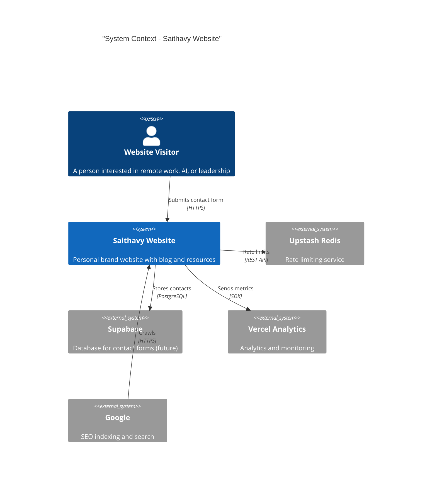
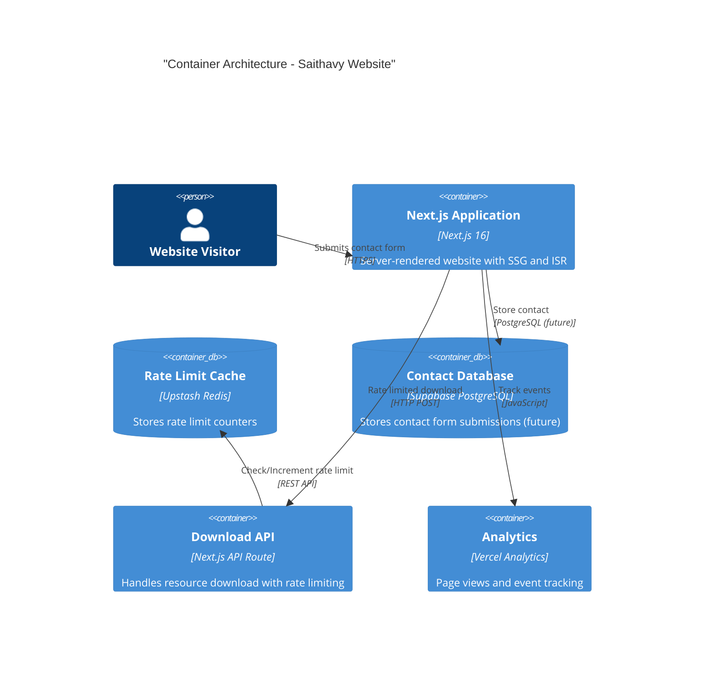
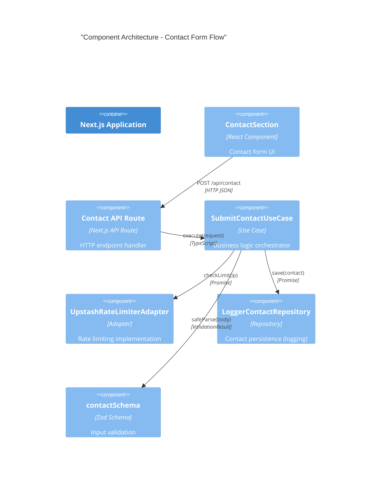
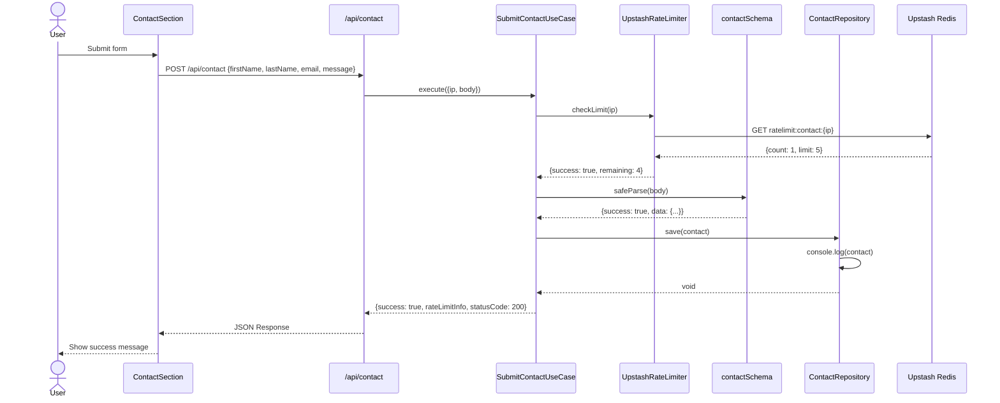
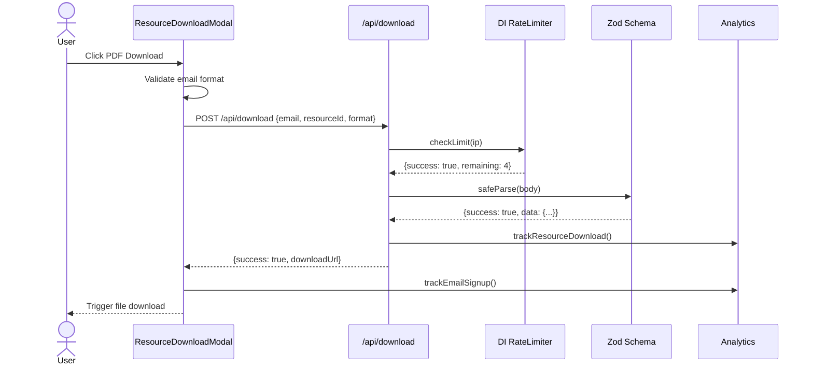
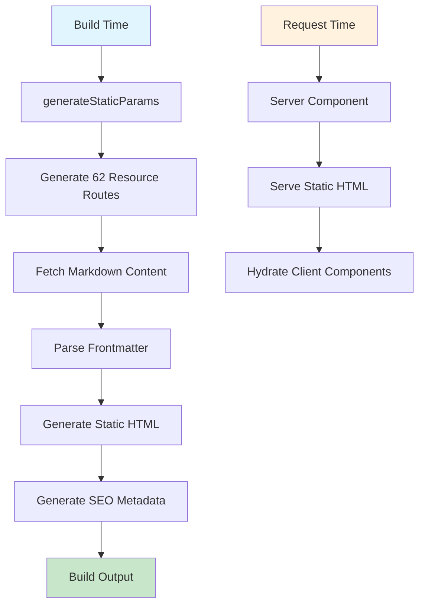
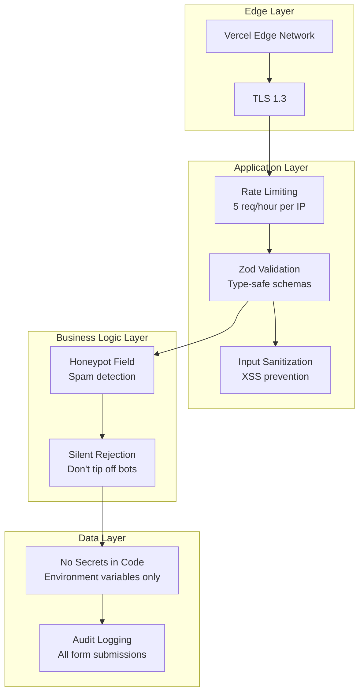
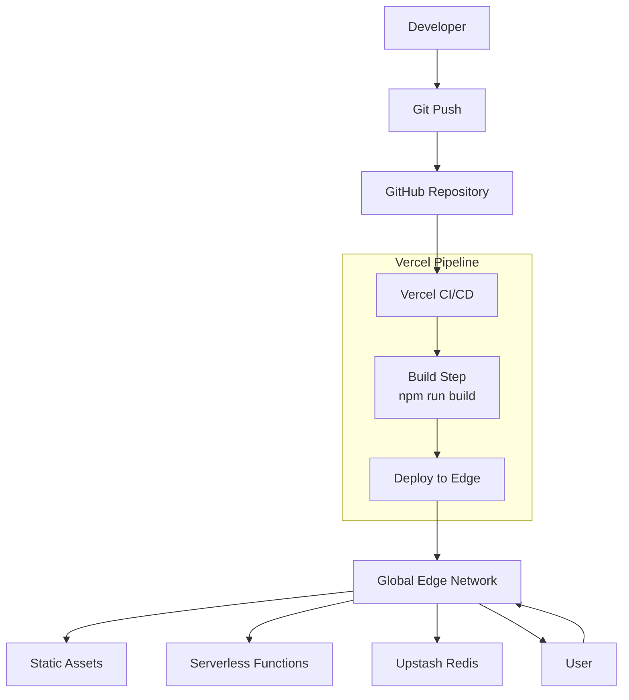
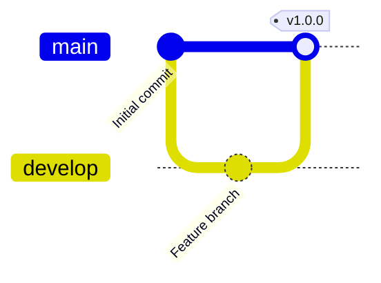

# Saithavy Next.js - Architecture Documentation

**Version**: 1.0.0
**Last Updated**: 2025-01-16
**Framework**: Next.js 16.1.6
**Language**: TypeScript 5

---

## Table of Contents

1. [System Overview](#system-overview)
2. [Architecture Principles](#architecture-principles)
3. [C4 Model](#c4-model)
4. [System Architecture](#system-architecture)
5. [Data Architecture](#data-architecture)
6. [Security Architecture](#security-architecture)
7. [Quality Attributes](#quality-attributes)
8. [Architecture Decision Records](#architecture-decision-records)
9. [Deployment Architecture](#deployment-architecture)
10. [Development Workflow](#development-workflow)

---

## System Overview

### Purpose

Saithavy is a modern personal website showcasing authentic remote work and AI operations expertise. The site serves as a platform for:

- **Brand Presence**: Professional portfolio and services showcase
- **Content Marketing**: Blog with MDX-based articles
- **Lead Generation**: Resource hub with email capture
- **Contact Management**: Rate-limited contact form
- **Audience Engagement**: 62 downloadable resources across 5 categories

### Scope

**In Scope**:
- Personal branding website with blog and resource hub
- Email capture and lead generation system
- Content management with static generation
- Contact form with rate limiting and spam protection
- Dark/light mode with system preference detection
- SEO optimization with sitemap and structured data

**Out of Scope**:
- User authentication (public access only)
- Payment processing (resources are free)
- Real-time features (static site generation)
- Multi-language support (English only)

---

## Architecture Principles

### 1. Domain-Driven Design (DDD)

The application follows Domain-Driven Design principles with clear separation of concerns:

```
┌─────────────────────────────────────────────────────────────┐
│                     Presentation Layer                       │
│                    (Next.js App Router)                      │
└─────────────────────────────────────────────────────────────┘
                              │
                              ▼
┌─────────────────────────────────────────────────────────────┐
│                      Application Layer                        │
│                     (Use Cases / Services)                    │
└─────────────────────────────────────────────────────────────┘
                              │
                              ▼
┌─────────────────────────────────────────────────────────────┐
│                        Domain Layer                          │
│              (Entities, Value Objects, Interfaces)           │
└─────────────────────────────────────────────────────────────┘
                              │
                              ▼
┌─────────────────────────────────────────────────────────────┐
│                   Infrastructure Layer                       │
│          (Adapters, External Services, DI Container)         │
└─────────────────────────────────────────────────────────────┘
```

### 2. Dependency Inversion

High-level modules don't depend on low-level modules. Both depend on abstractions (interfaces):

```typescript
// Domain defines the interface
interface IRateLimiter {
  checkLimit(ip: string): Promise<RateLimitResult>;
}

// Infrastructure implements
class UpstashRateLimiterAdapter implements IRateLimiter {
  // Upstash-specific implementation
}
```

### 3. Single Responsibility

Each component/class has one reason to change:
- **Pages**: Handle routing and layout
- **Components**: Handle UI presentation
- **Use Cases**: Handle business logic
- **Adapters**: Handle external integrations

### 4. Open/Closed Principle

Software entities are open for extension but closed for modification via the DI container:

```typescript
// Register new implementation without changing use case
container.registerOrUpdate(
  ServiceKeys.RateLimiter,
  () => new RedisRateLimiterAdapter() // Swappable implementation
);
```

---

## C4 Model

### Level 1: System Context



### Level 2: Container Diagram



### Level 3: Component Diagram



### Level 4: Code Structure

```
src/
├── app/                          # Presentation Layer (Next.js App Router)
│   ├── layout.tsx                # Root layout with providers
│   ├── page.tsx                  # Home page (Server Component)
│   ├── about/page.tsx            # About page (Server Component)
│   ├── blog/                     # Blog routes
│   │   ├── page.tsx              # Blog listing (SSG)
│   │   └── [slug]/page.tsx       # Blog post (SSG with ISR)
│   ├── resources/                # Resource hub routes
│   │   ├── page.tsx              # Resource listing (SSG)
│   │   ├── [category]/[slug]/    # Resource detail (SSG)
│   │   └── api/download/route.ts # Download API (Rate limited)
│   └── api/contact/route.ts      # Contact API (Rate limited)
│
├── components/                   # Presentation Components
│   ├── Navigation.tsx            # Site navigation
│   ├── Footer.tsx                # Site footer
│   ├── ThemeProvider.tsx         # Theme context provider
│   └── sections/                 # Page section components
│
├── domain/                       # Domain Layer (Business Logic)
│   ├── entities/                 # Domain entities
│   │   └── Contact.ts            # Contact entity
│   └── interfaces/               # Domain interfaces
│       ├── IContactRepository.ts # Contact repository contract
│       └── IRateLimiter.ts       # Rate limiter contract
│
├── use_cases/                   # Application Layer
│   └── SubmitContactUseCase.ts   # Contact submission business logic
│
├── adapters/                     # Infrastructure Layer
│   ├── gateways/                 # External service adapters
│   │   └── UpstashRateLimiterAdapter.ts
│   └── repositories/             # Data persistence adapters
│       └── LoggerContactRepository.ts
│
└── lib/                         # Shared utilities
    ├── di/                       # Dependency Injection
    │   ├── Container.ts          # DI container implementation
    │   ├── services.ts           # Service registration
    │   └── types.ts              # DI type definitions
    ├── validators.ts             # Zod validation schemas
    └── analytics.ts              # Analytics tracking
```

---

## System Architecture

### Request Flow: Contact Form Submission



### Request Flow: Resource Download



### Static Site Generation Flow



---

## Data Architecture

### Data Models

#### Contact Entity

```typescript
interface Contact {
  firstName: string;
  lastName: string;
  email: string;
  interest: "ai-consulting" | "remote-work" | "content-resources" | "speaking" | "other";
  message: string;
  timestamp: Date;
}
```

#### Resource Entity

```typescript
interface Resource {
  id: string;                    // Unique identifier
  slug: string;                  // URL-friendly identifier
  title: string;                 // Display title
  description: string;           // Short description
  category: ResourceCategory;   // ai-automation | mindful-leadership | etc.
  type: string;                  // PDF | Template | Guide | etc.
  coverImage: string;            // Image URL
  downloadUrl: string;           // Download endpoint
  pdfUrl?: string;               // Direct PDF link
  seoTitle?: string;             // SEO title override
  seoDescription?: string;       // Meta description
  keywords?: string[];           // SEO keywords
  difficulty?: string;           // Beginner | Intermediate | Advanced
  timeToRead?: string;           // Estimated time
  targetAudience: string;        // Primary audience
  whatYoullLearn: string[];      // Learning objectives
  featured: boolean;             // Show in featured section
  downloads: number;             // Download count
  isPremium?: boolean;           // Premium content flag
}
```

### Data Flow

```mermaid
flowchart LR
    subgraph Content Creation
        MD[Markdown Files] --> Parser[Frontmatter Parser]
        Parser --> Metadata[Resource Metadata]
        Parser --> Content[Markdown Content]
    end

    subgraph Build Time
        Metadata --> SSG[generateStaticParams]
        SSG --> Routes[62 Static Routes]
    end

    subgraph Request Time
        Routes[Static HTML] --> Server[Server Component]
        Content --> Server
        Server --> Client[Client Hydration]
    end

    subgraph User Interaction
        Client --> Modal[Download Modal]
        Modal --> API[/api/download]
        API --> RateLimit[Rate Limiter]
        RateLimit --> Success[Download Success]
    end
```

---

## Security Architecture

### Security Layers



### Security Measures

| Threat | Protection | Implementation |
|--------|-----------|----------------|
| **DDoS/Spam** | Rate Limiting | Upstash Redis, 5 req/hour per IP |
| **XSS** | Input Sanitization | Zod validation, React escaping |
| **Spam Bots** | Honeypot | Silent rejection, no error message |
| **Injection** | Parameterized Queries | Prepared statements (future) |
| **Secrets Exposure** | Environment Variables | `.env.local`, Vercel env vars |
| **CSRF** | SameSite Cookies | Default Next.js protection |
| **Data Breach** | Minimal PII | No passwords, minimal data stored |

### Rate Limiting Strategy

```typescript
// Rate Limit Configuration
const RATE_LIMITS = {
  contact: {
    windowMs: 60 * 60 * 1000,  // 1 hour
    maxRequests: 5,              // 5 submissions
  },
  download: {
    windowMs: 60 * 60 * 1000,  // 1 hour
    maxRequests: 5,              // 5 downloads
  }
};
```

**Response Headers**:
```
X-RateLimit-Limit: 5
X-RateLimit-Remaining: 4
X-RateLimit-Reset: 1642357200
Retry-After: 3600
```

---

## Quality Attributes

### Performance

| Attribute | Target | Implementation |
|-----------|--------|----------------|
| **FCP** | <1.8s | SSG, image optimization, code splitting |
| **LCP** | <2.5s | SSG, Next.js Image, font optimization |
| **TBT** | <200ms | Minimal JavaScript, lazy loading |
| **CLS** | <0.1 | Stable layout with size reservations |
| **TTI** | <3.8s | Progressive enhancement, critical CSS |

### Scalability

| Aspect | Strategy |
|--------|----------|
| **Static Assets** | Vercel Edge CDN (global distribution) |
| **API Routes** | Serverless functions (auto-scaling) |
| **Rate Limiting** | Upstash Redis (distributed, low latency) |
| **Database** | Supabase (managed PostgreSQL) |

### Reliability

| Aspect | Strategy |
|--------|----------|
| **Error Handling** | Try-catch with user-friendly messages |
| **Fallbacks** | Default content, graceful degradation |
| **Monitoring** | Vercel Analytics, Speed Insights |
| **Logging** | Console logs for development |

### Maintainability

| Aspect | Strategy |
|--------|----------|
| **Type Safety** | TypeScript strict mode |
| **Code Organization** | DDD layering |
| **Testing** | Zod schemas for validation |
| **Documentation** | ADRs, inline comments, README |
| **Code Review** | Git flow, peer review process |

---

## Architecture Decision Records

### ADR-001: Domain-Driven Design Architecture

**Status**: Accepted
**Date**: 2025-01-16
**Context**: Need for clean separation of concerns and testable business logic

**Decision**: Implement DDD layering with Domain, Application, and Infrastructure layers

**Consequences**:
- ✅ **Positive**: Testable business logic, swappable adapters, clear boundaries
- ⚠️ **Negative**: More boilerplate, steeper learning curve

---

### ADR-002: Custom Dependency Injection Container

**Status**: Accepted
**Date**: 2025-01-16
**Context**: Need for dependency injection without heavy frameworks

**Decision**: Build lightweight DI container with singleton/transient lifecycles

**Alternatives Considered**:
1. **InversifyJS** (Rejected: Too heavy, ~30KB)
2. **TSyringe** (Rejected: Limited TypeScript support)
3. **Custom DI** (Chosen: Lightweight, type-safe, circular dependency detection)

**Consequences**:
- ✅ **Positive**: Full control, minimal bundle size, type-safe resolution
- ⚠️ **Negative**: Manual service registration, maintenance overhead

---

### ADR-003: Next.js 16 App Router with Server Components

**Status**: Accepted
**Date**: 2025-01-16
**Context**: New project with greenfield opportunity

**Decision**: Use Next.js 16 App Router with React Server Components

**Rationale**:
- SSG for excellent performance
- Server Components reduce JavaScript payload
- Built-in optimization (images, fonts, routing)
- Future-proof with React 18+ features

**Consequences**:
- ✅ **Positive**: Better performance, SEO, developer experience
- ⚠️ **Negative**: Learning curve, client component markers needed

---

### ADR-004: Upstash Redis for Rate Limiting

**Status**: Accepted
**Date**: 2025-01-16
**Context**: Need for distributed rate limiting without managing servers

**Decision**: Use Upstash Redis for rate limiting

**Alternatives Considered**:
1. **In-memory** (Rejected: Doesn't scale, resets on restart)
2. **Self-hosted Redis** (Rejected: Ops overhead, cost)
3. **Vercel KV** (Rejected: Less mature)
4. **Upstash Redis** (Chosen: Serverless, edge-optimized, free tier)

**Consequences**:
- ✅ **Positive**: Low latency (<10ms), edge caching, free tier
- ⚠️ **Negative**: Vendor lock-in, API rate limits

---

### ADR-005: Zod for Runtime Validation

**Status**: Accepted
**Date**: 2025-01-16
**Context**: Need for type-safe runtime validation

**Decision**: Use Zod for all input validation (client + server)

**Rationale**:
- Shared schemas between client and server
- Automatic TypeScript type inference
- Excellent error messages
- Zero dependencies

**Example**:
```typescript
const contactSchema = z.object({
  firstName: z.string().min(1),
  email: z.string().email(),
  message: z.string().min(10),
});

type ContactInput = z.infer<typeof contactSchema>;
```

---

## Deployment Architecture

### Vercel Deployment



### Infrastructure

| Service | Provider | Purpose |
|---------|----------|---------|
| **Hosting** | Vercel | Edge deployment, CDN |
| **Rate Limiting** | Upstash | Distributed Redis |
| **Database** | Supabase | PostgreSQL (future) |
| **Analytics** | Vercel | Page views, speed insights |
| **DNS** | Vercel | Managed DNS |
| **SSL/TLS** | Vercel | Automatic HTTPS |

### Environment Configuration

```bash
# Production Environment Variables
NEXT_PUBLIC_SITE_URL=https://saithavy.com
UPSTASH_REDIS_REST_URL=https://xxx.upstash.io
UPSTASH_REDIS_REST_TOKEN=AXXXxxx
```

---

## Development Workflow

### Git Flow



### Branch Strategy

| Branch | Purpose | Protection |
|--------|---------|------------|
| `main` | Production code | Required reviews, status checks |
| `develop` | Integration branch | Required reviews |
| `feature/*` | Feature development | None |

### Commit Convention

Follow Conventional Commits:

```
feat: add resource download modal
fix: resolve rate limit header issue
docs: update architecture documentation
refactor: extract validation logic
test: add rate limiter tests
chore: upgrade dependencies
```

### Code Review Checklist

- [ ] TypeScript compiles without errors
- [ ] Tests pass (if applicable)
- [ ] No console errors or warnings
- [ ] Accessible (keyboard navigation, screen readers)
- [ ] Responsive (mobile, tablet, desktop)
- [ ] Performance impact assessed
- [ ] Security implications considered
- [ ] Documentation updated

---

## Appendix

### Technology Stack

| Category | Technology | Version |
|----------|-----------|---------|
| **Framework** | Next.js | 16.1.6 |
| **Language** | TypeScript | 5.x |
| **Styling** | Tailwind CSS | v4 |
| **Animations** | Anime.js, Typed.js, p5.js | Latest |
| **Forms** | React Hook Form | Latest |
| **Validation** | Zod | 4.x |
| **Theme** | next-themes | Latest |
| **Icons** | Lucide React | Latest |
| **Rate Limiting** | Upstash Redis | Latest |
| **Analytics** | Vercel Analytics | Latest |
| **Deployment** | Vercel | - |

### Key Metrics

| Metric | Value | Target |
|--------|-------|--------|
| **Bundle Size** | ~150KB gzipped | <200KB |
| **FCP** | ~0.8s | <1.8s |
| **LCP** | ~1.2s | <2.5s |
| **TBT** | ~50ms | <200ms |
| **CLS** | ~0.05 | <0.1 |
| **Lighthouse** | 95+ | 90+ |

### References

- [Next.js Documentation](https://nextjs.org/docs)
- [Domain-Driven Design](https://martinfowler.com/tags/domain%20driven%20design.html)
- [C4 Model](https://c4model.com/)
- [Architecture Decision Records](https://adr.github.io/)
- [OWASP Top 10](https://owasp.org/www-project-top-ten/)
- [Web Content Accessibility Guidelines](https://www.w3.org/WAI/WCAG21/quickref/)

---

**Document Version**: 1.0.0
**Last Reviewed**: 2025-01-16
**Next Review**: After major feature releases
