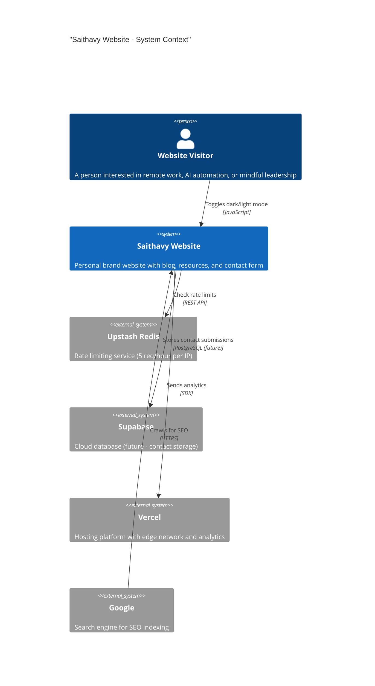
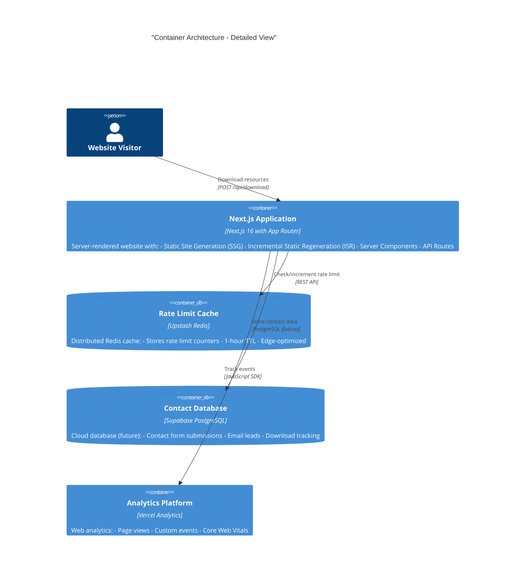
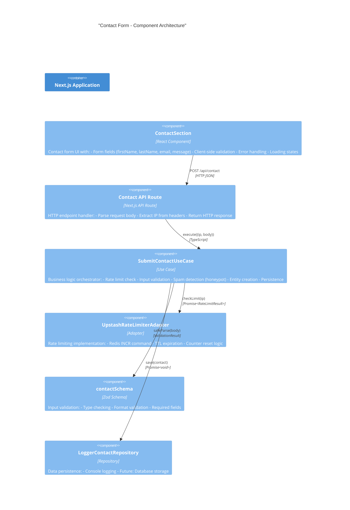
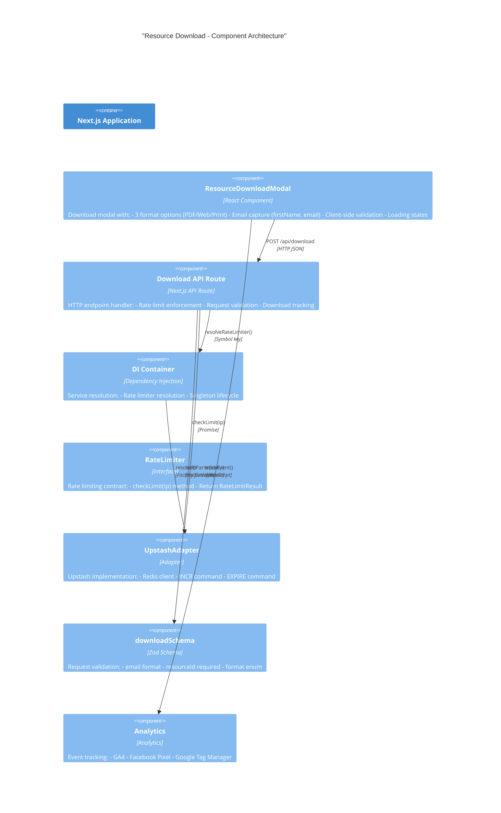
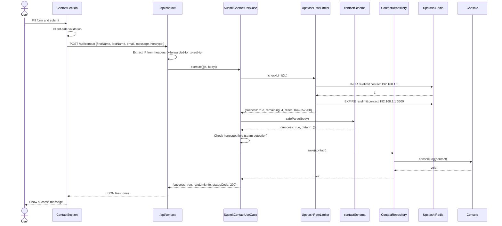
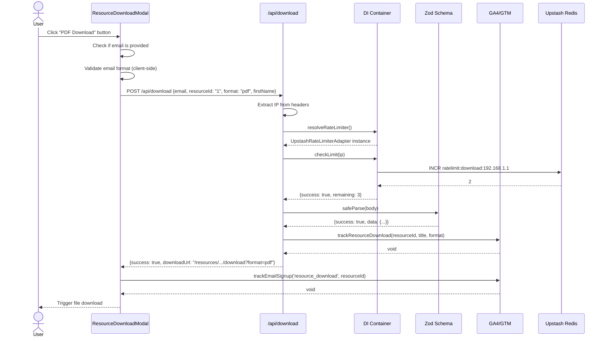
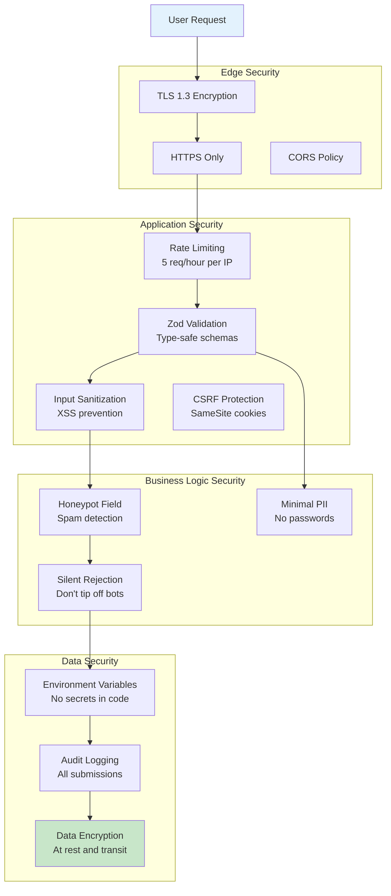
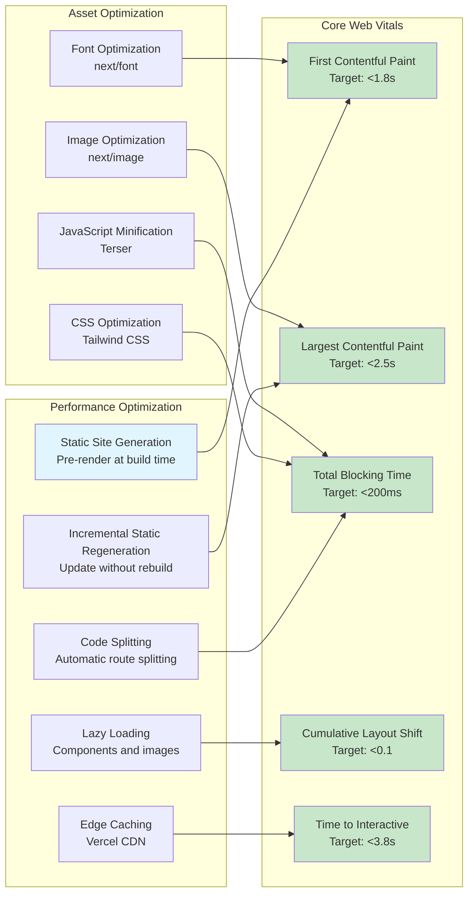

# Architecture Diagrams - Saithavy Next.js

**Version**: 1.0.0
**Last Updated**: 2025-01-16

This document contains comprehensive architecture diagrams for the Saithavy website.

---

## Table of Contents

1. [System Context Diagram](#system-context-diagram)
2. [Container Architecture](#container-architecture)
3. [Component Architecture](#component-architecture)
4. [Data Flow Diagrams](#data-flow-diagrams)
5. [Deployment Architecture](#deployment-architecture)
6. [Security Architecture](#security-architecture)

---

## System Context Diagram



**Key Stakeholders**:
- **Website Visitor**: End user consuming content
- **Site Owner**: Content creator and administrator

**External Systems**:
- **Upstash Redis**: Distributed rate limiting
- **Supabase**: Future database for contact storage
- **Vercel**: Hosting and analytics platform
- **Google**: Search indexing

---

## Container Architecture



**Technology Stack**:
- **Web Framework**: Next.js 16.1.6
- **Language**: TypeScript 5
- **Styling**: Tailwind CSS v4
- **Rate Limiting**: Upstash Redis
- **Database**: Supabase PostgreSQL (future)
- **Analytics**: Vercel Analytics + Speed Insights

---

## Component Architecture

### Contact Form Flow



### Resource Download Flow



---

## Data Flow Diagrams

### Contact Form Submission



### Resource Download with Email Capture



### Static Site Generation Build Process

```mermaid
flowchart TD
    A[Build Start] --> B[next build]
    B --> C[Next.js Build Process]

    C --> D[Generate Static Params]
    D --> E[resourcesData.ts - 62 resources]
    E --> F[Create route params: {category, slug}]

    F --> G[For each resource...]
    G --> H[Fetch markdown content]
    H --> I[Parse frontmatter]
    I --> J[Generate metadata]
    J --> K[Render Server Component]
    K --> L[Generate static HTML]

    L --> M[Optimize assets]
    M --> N[Minify JavaScript]
    N --> O[Optimize images]
    O --> P[Generate CSS]

    P --> Q[Build output: .next/]
    Q --> R[Public: static files]

    R --> S[Deployment Ready]

    style A fill:#e1f5fe
    style S fill:#c8e6c9
    style F fill:#fff3e0
```

---

## Deployment Architecture

```mermaid
flowchart TB
    subgraph "Development"
        Dev[Developer Machine]
        Local[Local Development<br/>localhost:3000]
        Dev -->|git push| Local
    end

    subgraph "CI/CD"
        GitHub[GitHub Repository]
        VercelCI[Vercel CI/CD Pipeline]
        Build[Build Step<br/>npm run build]
        Deploy[Deploy to Edge]
        GitHub --> VercelCI
        VercelCI --> Build
        Build --> Deploy
    end

    subgraph "Production"
        Edge[Vercel Edge Network<br/>Global CDN]
        CDN[Static Assets<br/>JS, CSS, Images]
        Functions[Serverless Functions<br/>API Routes]
        KV[Upstash Redis<br/>Rate Limiting]
        DB[Supabase PostgreSQL<br/>Future Database]
        Analytics[Vercel Analytics<br/>Page Views & Events]
    end

    subgraph "User"
        User[Website Visitor]
        Browser[Web Browser]
    end

    Deploy --> Edge
    Edge --> CDN
    Edge --> Functions
    Functions --> KV
    Functions --> DB
    Edge --> Analytics
    User --> Browser
    Browser --> Edge

    style Dev fill:#e3f2fd
    style User fill:#fff3e0
    style Edge fill:#c8e6c9
```

### Infrastructure Layers

| Layer | Service | Purpose | Region |
|-------|---------|---------|--------|
| **CDN** | Vercel Edge Network | Static asset delivery | Global |
| **Compute** | Vercel Serverless Functions | API routes, SSR | us-east-1 |
| **Cache** | Upstash Redis | Rate limiting | Global |
| **Database** | Supabase PostgreSQL | Contact storage | us-east-1 |
| **Analytics** | Vercel Analytics | Page views, events | Global |

---

## Security Architecture



### Security Layers Detail

| Layer | Protection | Implementation |
|-------|-------------|----------------|
| **Network** | TLS 1.3 | Vercel automatic HTTPS |
| **Edge** | DDoS Protection | Vercel edge network |
| **Application** | Rate Limiting | Upstash Redis, 5 req/hour |
| **Input** | Validation | Zod schemas, type-safe |
| **Output** | XSS Prevention | React auto-escaping |
| **Forms** | CSRF Protection | SameSite cookies |
| **Spam** | Honeypot | Silent rejection |
| **Data** | Minimal PII | No passwords, minimal data |

---

## Performance Architecture



---

## Glossary

| Term | Definition |
|------|------------|
| **SSG** | Static Site Generation - Pre-rendering pages at build time |
| **ISR** | Incremental Static Regeneration - Update static pages without rebuild |
| **DI** | Dependency Injection - Pattern for injecting dependencies |
| **DDD** | Domain-Driven Design - Architectural pattern focused on domain logic |
| **C4 Model** | Context, Containers, Components, Code - Diagramming model |
| **Zod** | TypeScript-first schema validation library |
| **Upstash** | Serverless Redis-compatible data platform |

---

**Document Version**: 1.0.0
**Last Updated**: 2025-01-16
**Maintained By**: Development Team
