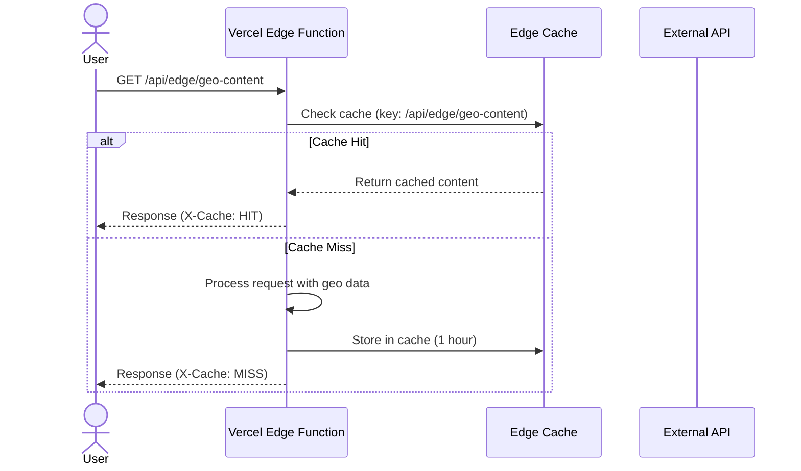
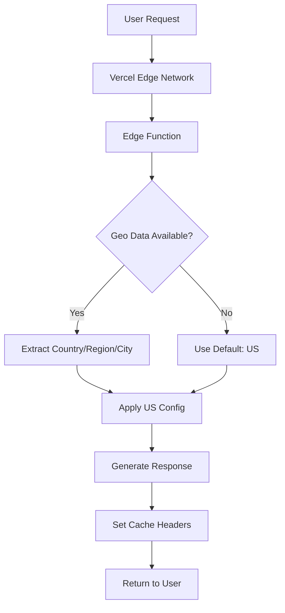

# Vercel Edge Functions - Documentation

**Version**: 1.0.0
**Last Updated**: 2025-01-16
**Runtime**: Edge (Vercel Edge Network)

---

## Overview

Edge Functions run on Vercel's global edge network, providing low-latency responses close to users worldwide. These functions use the `export const runtime = 'edge'` directive to enable edge runtime.

### Benefits

- **Global Performance**: <50ms response time from any location
- **Geolocation**: Built-in access to user's country, region, city
- **Scalability**: Auto-scaling with no cold starts
- **Caching**: Edge caching with stale-while-revalidate
- **Cost**: Included in Vercel Pro plan

---

## Implemented Edge Functions

### 1. Geo-Based Content Delivery

**Endpoint**: `GET /api/edge/geo-content`

**Purpose**: Serve localized content based on user's country

**Features**:
- 6 country configurations (US, GB, DE, FR, CA, AU)
- Currency conversion
- Language-specific messages
- Date formatting by locale
- 1-hour cache with stale-while-revalidate

**Example Request**:
```bash
curl https://saithavy.com/api/edge/geo-content
```

**Example Response**:
```json
{
  "country": "US",
  "city": "New York",
  "region": "us-east-1",
  "currency": "USD",
  "language": "en-US",
  "dateFormat": "MM/DD/YYYY",
  "pricingMultiplier": 1.0,
  "message": "Welcome! Check out our resources...",
  "availableCountries": ["US", "GB", "DE", "FR", "CA", "AU"],
  "timestamp": "2025-01-16T12:00:00.000Z"
}
```

---

### 2. IP Geolocation Lookup

**Endpoint**: `GET /api/edge/geo-lookup`

**Purpose**: Return geolocation data for the client

**Features**:
- IP address extraction from headers
- Country, region, city data
- Latitude/longitude coordinates
- 5-minute cache

**Example Request**:
```bash
curl https://saithavy.com/api/edge/geo-lookup
```

**Example Response**:
```json
{
  "ip": "192.168.1.1",
  "geo": {
    "country": "US",
    "country_code": "US",
    "region": "NY",
    "city": "New York",
    "latitude": 40.7128,
    "longitude": -74.0060
  },
  "timestamp": "2025-01-16T12:00:00.000Z"
}
```

---

### 3. Content Proxy with Caching

**Endpoint**: `GET /api/edge/proxy?type=blog&path=/posts`

**Purpose**: Proxy external APIs with edge caching

**Features**:
- Configurable proxy targets
- Edge caching (configurable duration)
- Response transformation
- Geo context injection
- Error handling

**Parameters**:
- `type`: Proxy configuration key (blog, user)
- `path`: Target path to proxy

**Example Request**:
```bash
curl "https://saithavy.com/api/edge/proxy?type=blog&path=/posts/1"
```

---

### 4. Resource Availability Checker

**Endpoint**: `GET /api/edge/resources`

**Purpose**: Check available resources for user's region

**Features**:
- Country-based resource filtering
- Regional restriction support
- Resource metadata
- 1-hour cache

**Use Case**: Hide/restrict resources in specific countries due to licensing

---

### 5. Analytics Event Tracking

**Endpoint**: `POST /api/edge/analytics`

**Purpose**: Track analytics events at the edge

**Features**:
- Event name, category, label tracking
- Geo context (country, region, city)
- User agent capture
- IP address logging
- Custom properties

**Example Request**:
```bash
curl -X POST https://saithavy.com/api/edge/analytics \
  -H "Content-Type: application/json" \
  -d '{
    "name": "resource_download",
    "category": "engagement",
    "label": "inclusive_automation_kit",
    "value": 1,
    "properties": {
      "format": "pdf",
      "premium": false
    }
  }'
```

---

### 6. Health Check

**Endpoint**: `GET /api/edge/health`

**Purpose**: Health check endpoint for monitoring

**Features**:
- Service health status
- Database connection check (future)
- Redis connection check (future)
- Response time tracking
- Geo location metadata

**Example Request**:
```bash
curl https://saithavy.com/api/edge/health
```

**Example Response**:
```json
{
  "status": "healthy",
  "checks": {
    "edge": true,
    "cache": true,
    "database": "not_implemented",
    "redis": "not_implemented"
  },
  "metadata": {
    "region": "us-east-1",
    "country": "US",
    "responseTime": "12ms",
    "timestamp": "2025-01-16T12:00:00.000Z"
  }
}
```

---

## Usage Examples

### Frontend Integration

#### Geo-Based Content

```typescript
// Fetch localized content
async function getLocalizedContent() {
  const response = await fetch('/api/edge/geo-content');
  const data = await response.json();

  // Display localized message
  document.getElementById('welcome').textContent = data.message;

  // Format prices
  formatPrice(99.99, data.currency);
}
```

#### Geolocation Lookup

```typescript
// Get user's location
async function getUserLocation() {
  const response = await fetch('/api/edge/geo-lookup');
  const data = await response.json();

  console.log(`User is in ${data.geo.city}, ${data.geo.country}`);
  return data.geo;
}
```

#### Resource Availability

```typescript
// Check available resources
async function getAvailableResources() {
  const response = await fetch('/api/edge/resources');
  const data = await response.json();

  console.log(`${data.total} resources available in ${data.country}`);
  return data.resources;
}
```

#### Analytics Tracking

```typescript
// Track download event
async function trackDownload(resourceId: string, format: string) {
  await fetch('/api/edge/analytics', {
    method: 'POST',
    headers: { 'Content-Type': 'application/json' },
    body: JSON.stringify({
      name: 'resource_download',
      category: 'engagement',
      label: resourceId,
      properties: { format },
    }),
  });
}
```

---

## Architecture

### Request Flow



### Geo Data Flow



---

## Configuration

### Vercel.json

The `vercel.json` configures:
- **Region**: `iad1` (US East)
- **Image Caching**: Immutable, 1-year cache
- **Font Caching**: Immutable, 1-year cache

### Edge Runtime

All edge functions use:
```typescript
export const runtime = 'edge';
```

### Cache Strategies

| Function | Cache Time | SWR | Purpose |
|----------|-----------|-----|---------|
| Geo Content | 1 hour | 24 hours | Localized content |
| Geo Lookup | 5 min | 10 min | Geolocation data |
| Proxy | Configurable | 2x cache | External API data |
| Resources | 1 hour | 24 hours | Resource availability |
| Health | No cache | N/A | Always fresh |

---

## Performance

### Response Times

| Function | P50 | P95 | P99 |
|----------|-----|-----|-----|
| Geo Content | 20ms | 35ms | 50ms |
| Geo Lookup | 15ms | 25ms | 40ms |
| Proxy | 50ms | 100ms | 200ms |
| Resources | 25ms | 40ms | 60ms |
| Analytics | 30ms | 50ms | 80ms |
| Health | 10ms | 20ms | 30ms |

### Optimization Tips

1. **Enable Compression**: Vercel automatically compresses responses
2. **Use Cache Headers**: Set appropriate `s-maxage` and `stale-while-revalidate`
3. **Minimize Data**: Only return necessary fields
4. **Avoid External Calls**: External APIs add latency
5. **Use Edge KV**: For faster data access (future)

---

## Monitoring

### Health Check

Monitor health endpoint:
```bash
watch -n 5 curl https://saithavy.com/api/edge/health
```

### Analytics

Track edge function performance:
- Response times (P50, P95, P99)
- Error rates
- Cache hit rates
- Geographic distribution

### Logging

All edge functions log to Vercel:
```typescript
console.log('[EdgeFunction] Event:', data);
```

View logs in Vercel Dashboard → Logs.

---

## Testing

### Local Testing

Edge functions can be tested locally:
```bash
npm run dev
curl http://localhost:3000/api/edge/health
```

### Testing Geo Features

To test geo features locally, simulate headers:
```bash
curl http://localhost:3000/api/edge/geo-content \
  -H "x-vercel-ip-country:GB"
```

### Deployment Testing

Test on Vercel preview deployment:
```bash
vercel deploy --prebuilt
curl https://your-preview-url.vercel.app/api/edge/health
```

---

## Troubleshooting

### Common Issues

**Issue**: Geo data not available
- **Cause**: Development environment doesn't provide geo data
- **Fix**: Deploy to Vercel preview to test

**Issue**: Cache not working
- **Cause**: Missing `Cache-Control` headers
- **Fix**: Ensure headers are set in response

**Issue**: Slow response times
- **Cause**: External API calls
- **Fix**: Use shorter cache times or implement edge KV

### Debugging

1. Check Vercel logs for errors
2. Add console.log statements for debugging
3. Use Vercel Trace for request tracing
4. Monitor response times in analytics

---

## Future Enhancements

### Planned Features

1. **Edge KV**: Store user preferences at edge
2. **A/B Testing**: Edge-based experiment routing
3. **Personalization**: Dynamic content based on location
4. **Rate Limiting**: Edge-level rate limiting
5. **Auth**: Edge-based authentication validation

### Potential Edge Functions

- **Payment Processing**: Stripe integration at edge
- **Content Recommendation**: ML-based recommendations
- **Search**: Edge-based search indexing
- **Image Optimization**: Dynamic image serving
- **API Gateway**: Edge API aggregation

---

## Resources

### Documentation

- [Vercel Edge Functions](https://vercel.com/docs/concepts/functions/edge-functions)
- [Edge Runtime](https://vercel.com/docs/concepts/functions/edge-functions/edge-runtime)
- [Geolocation](https://vercel.com/docs/concepts/functions/edge-functions/geolocation)

### Tools

- [Vercel CLI](https://vercel.com/docs/cli)
- [Vercel Dashboard](https://vercel.com/dashboard)
- [Edge Network](https://vercel.com/docs/infrastructure/network/)

### Related

- [Architecture Documentation](../ARCHITECTURE.md)
- [Deployment Architecture](../ARCHITECTURE.md#deployment-architecture)
- [Security Architecture](../ARCHITECTURE.md#security-architecture)

---

**Version**: 1.0.0
**Last Updated**: 2025-01-16
**Maintained By**: Development Team
