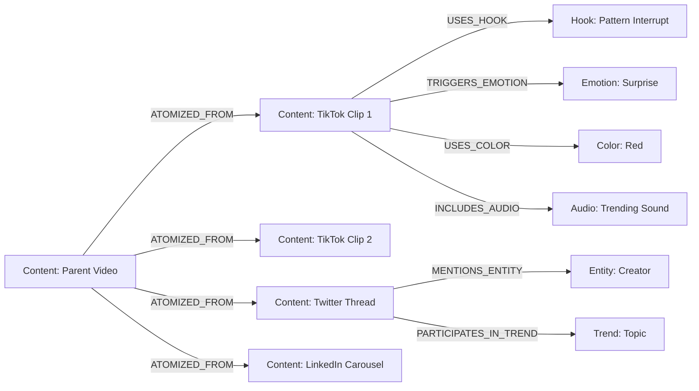
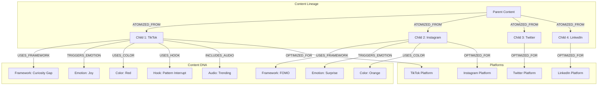
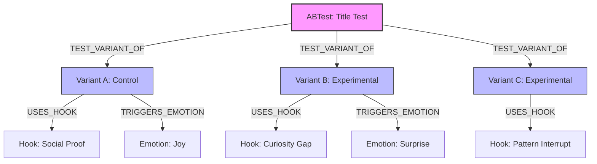
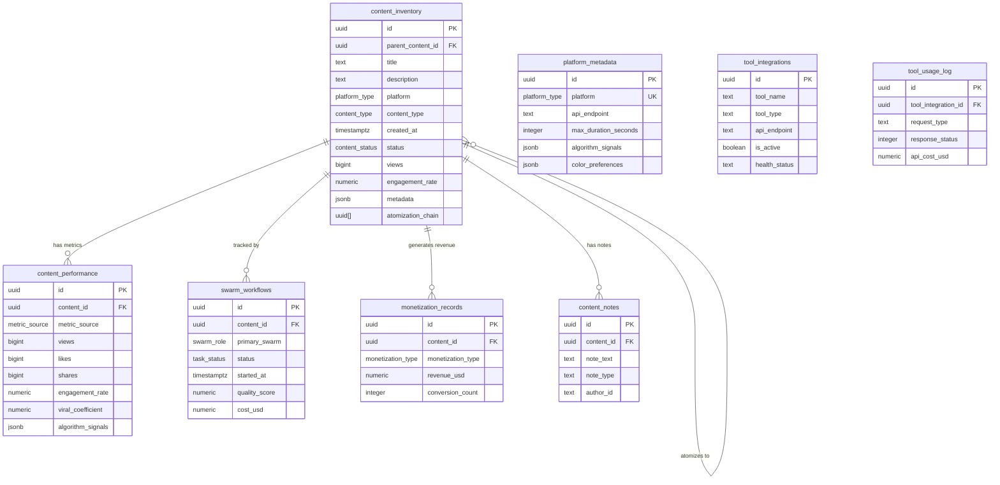
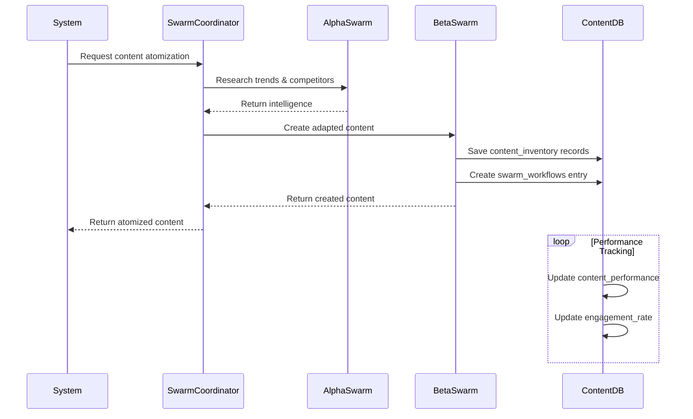
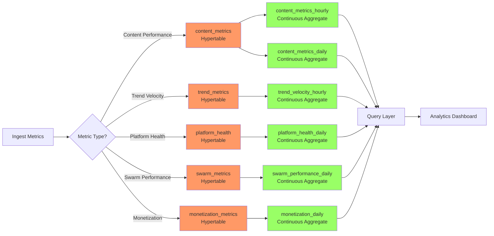
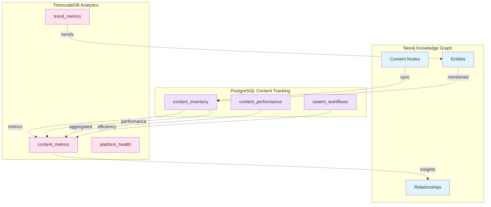

# Entity-Relationship Diagrams

This document contains Mermaid diagrams for all three databases in the Swarm Agency system.

## Table of Contents
1. [Knowledge Graph Database (Neo4j)](#knowledge-graph-database)
2. [Content Tracking Database (PostgreSQL)](#content-tracking-database)
3. [Analytics Database (TimescaleDB)](#analytics-database)

---

## Knowledge Graph Database (Neo4j)

### Main Content Relationships



### Content DNA and Lineage



### A/B Test Relationships



---

## Content Tracking Database (PostgreSQL)

### Core Schema



### Content Atomization Flow

```mermaid
flowchart TD
    A[Create Parent Content] --> B[Save to content_inventory]
    B --> C{Atomize?}
    C -->|Yes| D[Create Child Content Records]
    C -->|No| E[Publish Directly]

    D --> F[Link via parent_content_id]
    F --> G[Update atomization_chain]
    G --> H[Track in swarm_workflows]

    H --> I{Platform Type?}
    I -->|TikTok| J[Apply TikTok Metadata]
    I -->|Instagram| K[Apply Instagram Metadata]
    I -->|YouTube| L[Apply YouTube Metadata]

    J --> M[Schedule/Publish]
    K --> M
    L --> M

    M --> N[Track Performance]
    N --> O[Update content_performance]

    E --> N
```



### Swarm Workflow Integration



---

## Analytics Database (TimescaleDB)

### Hypertable Architecture

```mermaid
graph TB
    subgraph Raw Data Hypertables
        CM[content_metrics<br/>(1-hour chunks)]
        PH[platform_health<br/>(1-day chunks)]
        TM[trend_metrics<br/>(1-hour chunks)]
        SM[swarm_metrics<br/>(1-hour chunks)]
        MM[monetization_metrics<br/>(1-day chunks)]
    end

    subgraph Continuous Aggregates
        CMH[content_metrics_hourly]
        CMD[content_metrics_daily]
        PHD[platform_health_daily]
        TVH[trend_velocity_hourly]
        SPD[swarm_performance_daily]
        MD[monetization_daily]
    end

    subgraph Compression & Retention
        C1[Compress after 7 days]
        C2[Compress after 30 days]
        R1[Retain 90 days]
        R2[Retain 2 years]
        R3[Retain 7 years]
    end

    CM -->|rollup| CMH
    CM -->|rollup| CMD
    CM --> C1
    CM --> R1

    PH -->|rollup| PHD
    PH --> C2
    PH --> R2

    TM -->|rollup| TVH
    TM --> C1
    TM --> R1

    SM -->|rollup| SPD
    SM --> C1

    MM -->|rollup| MD
    MM --> R3

    style CM fill:#f96,stroke:#333
    style PH fill:#f96,stroke:#333
    style TM fill:#f96,stroke:#333
    style SM fill:#f96,stroke:#333
    style MM fill:#f96,stroke:#333
    style CMH fill:#9f6,stroke:#333
    style CMD fill:#9f6,stroke:#333
    style PHD fill:#9f6,stroke:#333
    style TVH fill:#9f6,stroke:#333
    style SPD fill:#9f6,stroke:#333
    style MD fill:#9f6,stroke:#333
```

### Time-Series Data Flow



### Cross-Database Relationships



---

## Index Strategy Summary

### Neo4j Indexes
- **Unique constraints** on all node IDs
- **Full-text search** on content titles and descriptions
- **Vector indexes** for semantic similarity (1536 dimensions)
- **Performance indexes** on created_at, status, platform
- **Relationship indexes** for fast traversal

### PostgreSQL Indexes
- **Composite indexes** on (platform, published_at) for common queries
- **Partial indexes** for platform-specific queries (only published content)
- **GIN indexes** on JSONB metadata, tags, hashtags
- **GIN indexes** on full-text search vectors
- **BRIN indexes** on time-series data (for future TimescaleDB migration)

### TimescaleDB Indexes
- **Hypertable indexes** on time DESC for time-series queries
- **Composite indexes** on (content_id, time) for content-specific queries
- **Chunk-based indexes** for efficient partition pruning
- **Compression** reduces storage by 80-90%

---

## Performance Characteristics

| Database | Query Type | Latency | Throughput |
|----------|-----------|---------|------------|
| Neo4j | Relationship traversal | <10ms | 1000 queries/sec |
| Neo4j | Vector similarity search | <50ms | 100 queries/sec |
| PostgreSQL | Content lookup | <5ms | 10,000 queries/sec |
| PostgreSQL | Full-text search | <20ms | 5,000 queries/sec |
| TimescaleDB | Time-series aggregation | <100ms | 1,000 queries/sec |
| TimescaleDB | Continuous aggregate | <50ms | 2,000 queries/sec |

---

## Schema Version History

| Version | Date | Changes |
|---------|------|---------|
| 1.0.0 | 2026-03-14 | Initial schema design with all three databases |
